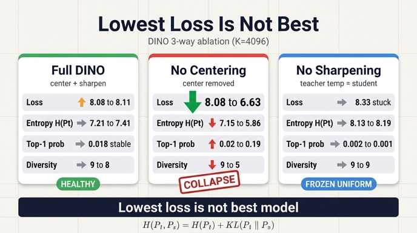

# §11 3-way ablation — centering을 제거하면 loss는 어떻게 되는가

> **한 줄 답**: 세 설정 중 **가장 많이 내려간다** (8.076 → 6.628, $-1.45$).
> 그런데 그게 좋은 신호가 아니다. 같은 구간에서 $H(P_t)$ 가 7.151 → 5.862 로 떨어지고,
> 교사 top-1 확률이 0.020 → 0.192 로 오르고, argmax 다양성이 9 → 5 로 줄어든다.
> **loss가 가장 낮은 설정이 가장 망가진 설정이다.**

---

## 1. 실험 설계 — 같은 루프를 세 설정으로

노트북 §11(`dino_training_walkthrough.py` 747행~)은 `train_one_epoch` 과 **완전히 같은 순서**의 미니 학습 루프를
세 가지 설정으로 돌린다. DDP만 없고, teacher temperature는 warmup 없이 고정이다.

| 항목 | 값 |
|---|---|
| backbone | `vit_tiny` / patch 16 (`ARCH, PATCH, OUT_DIM = "vit_tiny", 16, 4096`) |
| 프로토타입 수 | $K = 4096$ → $\log K = 8.318$, $1/K = 0.00024$ |
| 배치 | `BATCH = 8` (multi-crop 2 global + 8 local; 교사는 global 2개만 보므로 진단용 행 수는 $2\times8=16$) |
| 길이 | 3 epoch $\times$ 75 iter $=$ 225 step, 세 런 합쳐 **675 step / 약 60초** |
| optimizer | AdamW + `cosine_scheduler` (lr / wd / EMA momentum 3종), `clip_gradients(3.0)`, `cancel_gradients_last_layer(epoch, st, 1)` |
| 학생 온도 | $\tau_s = 0.1$ (`DINOLoss` 기본값) |

세 설정:

| 설정 | centering | $\tau_t$ | 예상 |
|---|---|---|---|
| DINO (center + sharpen) | O | 0.04 | 건강 |
| **centering 제거** | X | 0.04 | 단일 프로토타입 쪽으로 붕괴 |
| sharpening 제거 | O | 0.10 $(=\tau_s)$ | uniform 붕괴 |

### 구현 트릭 두 개

두 ablation 모두 **모델이나 손실 코드를 고치지 않고** 한 줄로 만든다.

```python
dl_ = DINOLoss(OUT_DIM, 2 + 8, teacher_temp, teacher_temp, 0, epochs).to(DEVICE)
if not use_center:
    dl_.update_center = lambda *a, **k: None      # center 를 0 으로 고정 = centering 제거
```

- **centering 제거** — `DINOLoss.center` 는 `register_buffer("center", torch.zeros(1, out_dim))` 로 **0에서 시작**한다.
  `update_center` 를 no-op으로 갈아끼우면 EMA 갱신이 영영 일어나지 않아 $c \equiv 0$ 이 되고,
  `forward` 의 `teacher_output - self.center` 가 항등식이 된다. 즉 **뺄셈만 사라진다.**
  monkey-patch 한 줄로 "centering 없는 DINO"가 정확히 재현된다.
- **sharpening 제거** — 생성자에 `warmup_teacher_temp = teacher_temp = 0.10` 을 넣어 $\tau_t = \tau_s = 0.1$ 로 맞춘다.
  교사와 학생이 같은 온도면 "교사가 학생보다 확신에 차 있다"는 비대칭이 사라져 학습 신호 자체가 없어진다.
  (`teacher_temp=student_temp` 설정.)

매 step 다섯 개 진단량을 기록한다 — `loss`, `H_t`, `top1`, `uniq`, `cnorm`:

```python
p_t = F.softmax((teacher_output.float() - dl_.center) / teacher_temp, dim=-1)
h["H_t"].append((-(p_t * p_t.clamp_min(1e-12).log()).sum(-1)).mean().item())
h["top1"].append(p_t.max(-1).values.mean().item())
h["uniq"].append(p_t.argmax(-1).unique().numel())
h["cnorm"].append(dl_.center.norm().item())
```

---

## 2. 결과 표 (전체)

$\log K = 8.318$, $1/K = 0.00024$. 끝값은 마지막 20 step 평균.

| 설정 | centering | $\tau_t$ | **loss** 처음→끝 | $H(P_t)$ 처음→끝 | 교사 top-1 처음→끝 | argmax 다양성 (16행) |
|---|---|---|---|---|---|---|
| DINO (center + sharpen) | O | 0.04 | 8.076 → **8.114** | 7.212 → 7.408 | 0.018 → 0.018 | 9 → 8 |
| **centering 제거** | X | 0.04 | 8.076 → **6.628** | 7.151 → **5.862** | 0.020 → **0.192** | 9 → **5** |
| sharpening 제거 | O | 0.10 | 8.332 → **8.331** | 8.134 → 8.188 | 0.002 → 0.001 | 9 → 9 |

세 열을 한꺼번에 읽으면 이렇다.

- loss만 보면 **centering 제거가 압도적 1등**이다. 나머지 둘은 사실상 제자리.
- 그런데 나머지 세 진단량은 centering 제거만 혼자 **붕괴 방향**으로 움직였다.

---

## 3. 왜 "가장 많이 내려간다"가 좋은 신호가 아닌가

§7의 분해가 정확히 이 상황을 설명한다.

$$
H\big(P_t, P_s\big) \;=\; \underbrace{H(P_t)}_{\text{교사 분포의 엔트로피}} \;+\; \underbrace{D_{\mathrm{KL}}\big(P_t \,\|\, P_s\big)}_{\text{두 view 정렬}}
$$

로그에 찍히는 loss는 **두 항의 합**이다. 그래서 loss가 내려갔다는 사실만으로는
"학생이 교사를 잘 따라가게 됐다($D_{\mathrm{KL}}\downarrow$)"인지
"교사가 그냥 뾰족해졌다($H(P_t)\downarrow$)"인지 **구별할 수 없다.**

### 감소분을 실제로 쪼개 보자

$$
\Delta\,H(P_t,P_s) = 6.628 - 8.076 = -1.448
$$
$$
\Delta\,H(P_t) = 5.862 - 7.151 = -1.289
$$
$$
\Delta\,D_{\mathrm{KL}} = \Delta H(P_t,P_s) - \Delta H(P_t) = -1.448 - (-1.289) = -0.159
$$

**감소분 1.45 중 1.29(≈ 89%)가 $H(P_t)$ 항에서 나왔다.** 실제로 "정렬"이 기여한 몫은 0.16뿐이다.

즉 이 런은 두 view를 맞추는 법을 배운 게 아니라,
**시험 문제를 스스로 쉽게 만들어서** 점수를 올린 것이다.
(지도학습에서는 타겟이 고정 one-hot이라 $H(y)=0$ 이 상수여서 이 지름길이 없다.
자기지도학습이 위험한 이유가 정확히 **타겟을 모델이 스스로 만들기 때문**이다.)

### 규모 감각: top-1 0.192가 얼마나 큰가

$K = 4096$ 에서 완전 uniform이면 top-1 확률은 $1/K = 0.00024$ 다.

$$
\frac{0.192}{0.00024} \approx 787 \;\;(\text{약 800배})
$$

한 프로토타입이 이미 교사 확률질량의 약 **1/5**을 먹고 있다는 뜻이다.
건강한 DINO 런의 0.018 과 비교해도 **10배 이상**이다.
시작값이 0.020 이었으므로 225 step 만에 약 10배로 뛴 것이고, 곡선은 아직 상승 중이다.

### argmax 다양성 9 → 5: marginal 쏠림의 직접 증거

$H(P_t)$ 와 top-1 은 **행마다 따로 보는** conditional 지표라서
"입력마다 다른 프로토타입을 뾰족하게 고르는" 건강한 상태와도 양립할 수 있다.
그걸 갈라주는 게 **argmax 다양성** — 배치 16행이 서로 다른 프로토타입 몇 개를 argmax로 고르는가다.

- 정상 DINO: 9 → 8 (유지)
- sharpening 제거: 9 → 9 (유지, 대신 확률차가 없음)
- **centering 제거: 9 → 5** — 16행이 이제 프로토타입 5개에 몰린다.

이건 conditional이 아니라 **marginal $\bar P_t = \frac{1}{B}\sum_b P_t^{(b)}$ 이 쏠렸다**는 직접 증거다.
극한값이 1이고, 그게 "모든 입력이 같은 답으로 간다" = 단일 프로토타입 붕괴다.
centering이 바로 이 marginal을 담당하는 장치이므로, 제거했을 때 이 지표가 무너지는 건 예측된 결과다.

---

## 4. 왜 centering 없이 sharpening만 있으면 이 방향으로 가는가 — 자기강화 루프

§7의 결론: 두 장치는 **서로 반대 방향으로 민다**.
sharpening($\tau_t < \tau_s$)은 one-hot 쪽으로, centering($z_t - c$)은 uniform 쪽으로.
하나만 남으면 남은 쪽 방향으로 끝까지 간다.

centering을 빼면 $\tau_t = 0.04$ 짜리 sharpening만 남고, 다음 루프가 돈다.

1. 초기화 노이즈나 데이터 편향으로 어떤 프로토타입 $k^\*$ 의 로짓이 아주 약간 높다.
2. $\tau_t = 0.04$ 로 나누면 그 **작은 차이가 25배로 증폭**된다 — softmax 후 $k^\*$ 가 배치 대부분에서 argmax가 된다.
3. 교사의 타겟 $P_t$ 가 $k^\*$ 에 몰리므로, 학생은 "무슨 입력이든 $k^\*$" 를 배우도록 gradient를 받는다.
4. EMA로 학생을 따라가는 교사도 같은 방향으로 이동 → $k^\*$ 로짓이 **더** 커진다.
5. 2로 돌아간다.

정상 DINO에서는 3.5단계가 끼어든다. center $c$ 가 배치 평균 로짓을 EMA로 흡수하므로
$k^\*$ 가 커질수록 $c_{k^\*}$ 도 커지고, $z_t - c$ 에서 그만큼 도로 빠진다.
§7의 시뮬레이션이 이걸 그대로 보여준다 — 프로토타입 0에 `bias = 2.0` 을 인위로 넣었을 때
학습된 center의 `c[0]` 이 그 2.0을 흡수하고 argmax는 다시 흩어진다.
반대로 centering 없이는 흡수해 줄 것이 없어서 루프가 그대로 발산한다.

주의할 대칭점 하나: **centering은 엔트로피를 올리는 장치가 아니다** (§7 패널 C).
centering은 "어떤 프로토타입이 뽑히나"의 균형을, sharpening은 "얼마나 확신하나"를 담당한다.
둘은 서로를 대체하지 못한다 — 그래서 하나를 빼면 다른 하나가 메워 주지 못하고 그대로 붕괴한다.

---

## 5. 실전 교훈

`main_dino.py` 의 사전학습 루프에는 **검증이 전혀 없다.** loss / lr / wd 세 개만 로깅한다.
그리고 이 실험이 보여주듯 **붕괴는 loss를 더 잘 낮춘다.**

- **loss 곡선만 보면 정확히 거꾸로 읽는다.** 이 실험에서 가장 예쁘게 내려간 곡선이 붕괴 중인 런이었고,
  유일하게 건강한 런은 loss가 **오히려 올라갔다**(8.076 → 8.114).
- 그러니 학습 로그에 **진단량을 직접 찍어야 한다.**

| 진단량 | 정의 | 붕괴 신호 |
|---|---|---|
| 교사 엔트로피 | $H(P_t) = -\sum_k P_t(k)\log P_t(k)$ | $\to 0$ (단일 프로토타입) 또는 $\to \log K$ (uniform) |
| 교사 top-1 확률 | $\max_k P_t(k)$ | $\to 1$ |
| argmax 다양성 | 배치 내 서로 다른 argmax 프로토타입 수 | $\to 1$ |
| center 노름 | $\lVert c \rVert_2$ | 발산 |

- 기준선 두 개를 항상 같이 찍어 두면 읽기가 쉽다: $\log K$ 와 $1/K$.
  건강한 상태는 $H(P_t)$ 가 $\log K$ 보다 확실히 낮고, top-1 이 $1/K$ 보다 확실히 큰 — **두 붕괴 영역 사이에 매달린** 상태다.
- 반대 방향 오독도 있다. sharpening 제거 런은 loss가 $\log K$ 에 붙어 안 내려가지만
  이건 "학습이 어렵다"가 아니라 **gradient가 사라진 uniform 평탄면**이다. 역시 loss만으로는 구별되지 않는다.

### 주의 — 절대값은 참고용

이건 수백 step(설정당 225 step)짜리 미니 학습이다.

- **이 구간에서 표현은 학습되지 않는다.** DINO의 loss는 학습 초반 오랫동안 $\log K$ 근처 평탄면에 머물고,
  구조는 그 위에서 서서히 생긴다 — ImageNet ViT-S/16, 8 GPU, 100 epoch 기준 **약 1.75일**.
- 따라서 6.628 / 5.862 같은 **절대값 자체에 의미를 두면 안 된다**. 데이터셋·시드·배치가 바뀌면 숫자는 바뀐다.
- 핵심은 **추세와 방향**이다: centering을 빼면 loss는 내려가면서 $H(P_t)\downarrow$, top-1$\uparrow$, 다양성$\downarrow$ 이 **동시에** 일어난다.
  여기서 확인한 것은 "파이프라인이 돌고, 진단량이 붕괴 영역으로 떨어지지 않는다"까지다.

---

## 6. 요약

| 질문 | 답 |
|---|---|
| centering 제거 시 loss는? | 세 설정 중 **가장 많이 내려간다**: 8.076 → 6.628 ($-1.45$) |
| 좋은 신호인가? | **아니다.** 감소분 1.45 중 1.29가 $H(P_t)$ 하락분 — 정렬이 아니라 교사가 뾰족해진 것 |
| 동반 증상 | $H(P_t)$ 7.151 → 5.862, top-1 0.020 → 0.192 ($1/K$ 의 약 800배), argmax 다양성 9 → 5 |
| 붕괴 유형 | **단일 프로토타입 collapse** (marginal 쏠림) |
| 원인 | centering이 없으면 sharpening의 자기강화 루프를 흡수할 것이 없다 |
| 교훈 | loss는 붕괴 탐지에 쓸 수 없다. $H(P_t)$ · top-1 · argmax 다양성 · $\lVert c\rVert$ 를 로깅하라 |

---

## 인포그래픽


