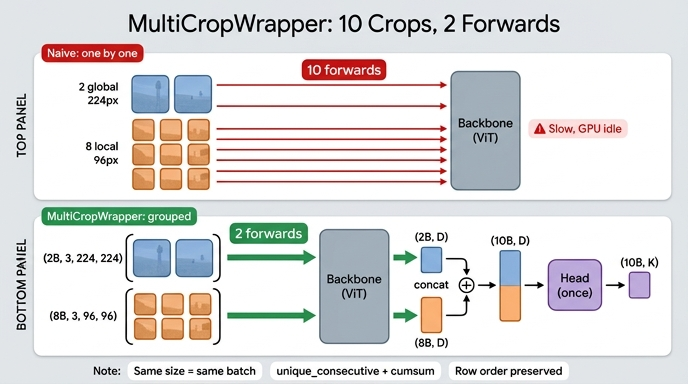

# `MultiCropWrapper`가 해결하는 문제

> **한 줄 답**: 해상도가 다른 crop들을 효율적으로 forward하는 문제. 같은 해상도끼리 concat해 묶어 넣으므로 crop 10개를 backbone forward **2회**로 처리한다.

---

## 1. 문제 정의 — 왜 그냥 한 텐서로 못 묶는가

DINO의 multi-crop 증강은 이미지 한 장에서 crop을 $2 + N$개 만든다 (기본 $N = 8$).

| 종류 | 개수 | 해상도 | ViT/16 패치 수 | 토큰 수 (CLS 포함) |
|---|---|---|---|---|
| global | 2 | $224 \times 224$ | $(224/16)^2 = 196$ | **197** |
| local | 8 | $96 \times 96$ | $(96/16)^2 = 36$ | **37** |

`torch.stack`으로 10개를 한 텐서에 넣으려면 모든 차원이 같아야 한다. 그런데 $224 \ne 96$이라 **stack 자체가 불가능**하다. 설령 패딩으로 억지로 맞춰도 ViT는 한 배치 안의 모든 샘플이 **같은 토큰 수**를 가져야 self-attention 행렬 $(B, h, N, N)$이 성립하므로 197과 37을 섞을 수 없다.

그렇다고 순진하게 crop마다 따로 돌리면:

```python
outs = [backbone(c) for c in crops]   # forward 10회
```

- backbone 호출 **10회** → 커널 런치 오버헤드 10배, GPU 점유율 저하
- global 2개는 어차피 같은 shape인데도 따로 도는 낭비
- local 8개는 배치가 작아 GPU가 텅 빈 채로 8번 돈다

`MultiCropWrapper`가 해결하는 것이 정확히 이 지점이다: **shape이 같은 것끼리는 배치 차원으로 합칠 수 있다**는 사실을 이용해 forward 횟수를 "crop 개수"가 아니라 **"서로 다른 해상도 개수"**로 줄인다.

$$
\text{forward 횟수} = |\{\text{crop 해상도}\}| = 2 \quad (\ne 10)
$$

---

## 2. 해법의 핵심 아이디어

crop 리스트가 해상도별로 **연속 정렬**되어 있다고 가정하고,

$$
\underbrace{[224, 224]}_{\text{group 1}},\ \underbrace{[96,96,96,96,96,96,96,96]}_{\text{group 2}}
$$

각 그룹을 배치 차원으로 이어붙여 딱 두 번만 backbone에 넣는다.

$$
(2B,\ 3,\ 224,\ 224) \xrightarrow{\ f_\theta\ } (2B,\ D)
\qquad
(8B,\ 3,\ 96,\ 96) \xrightarrow{\ f_\theta\ } (8B,\ D)
$$

두 출력을 다시 이어 $(10B, D)$를 만들고, head는 **딱 한 번** 통과시킨다.

---

## 3. 코드 단계별 해부

`utils.py`의 실제 구현:

```python
class MultiCropWrapper(nn.Module):
    def __init__(self, backbone, head):
        super(MultiCropWrapper, self).__init__()
        # disable layers dedicated to ImageNet labels classification
        backbone.fc, backbone.head = nn.Identity(), nn.Identity()
        self.backbone = backbone
        self.head = head

    def forward(self, x):
        if not isinstance(x, list):
            x = [x]
        idx_crops = torch.cumsum(torch.unique_consecutive(
            torch.tensor([inp.shape[-1] for inp in x]),
            return_counts=True,
        )[1], 0)
        start_idx, output = 0, torch.empty(0).to(x[0].device)
        for end_idx in idx_crops:
            _out = self.backbone(torch.cat(x[start_idx: end_idx]))
            if isinstance(_out, tuple):      # XCiT는 tuple 반환
                _out = _out[0]
            output = torch.cat((output, _out))
            start_idx = end_idx
        return self.head(output)
```

### (a) `__init__` — 분류 head 제거

```python
backbone.fc, backbone.head = nn.Identity(), nn.Identity()
```

torchvision ResNet의 `fc`, timm/ViT의 `head`는 ImageNet 1000-class 분류층이다. self-supervised에는 쓸모없으므로 `Identity`로 갈아끼워 backbone이 **특징 벡터**(ViT라면 CLS 토큰 $\in \mathbb{R}^{D}$)를 그대로 뱉게 만든다. 그 뒤에 붙는 것은 DINO 전용 `DINOHead`다. 즉 $g_\theta = h_\theta \circ f_\theta$ 조립기 역할도 겸한다.

### (b) 해상도 리스트 뽑기

```python
torch.tensor([inp.shape[-1] for inp in x])
# -> [224, 224, 96, 96, 96, 96, 96, 96, 96, 96]
```

`shape[-1]`은 폭(W)이다. DINO crop은 정사각이라 폭 하나로 해상도를 식별할 수 있다.

### (c) `unique_consecutive(..., return_counts=True)[1]` — 연속 구간 길이

```python
# values: [224, 96]   counts: [2, 8]     <- [1]이 counts
```

`unique`가 아니라 **`unique_consecutive`**임에 주의. 정렬하지 않고 **인접한 중복만** 묶는다. 그래서 리스트 순서를 바꾸지 않고도 구간을 잡을 수 있지만, 대신 **해상도가 연속으로 모여 있어야 한다**는 암묵적 계약이 생긴다.

### (d) `cumsum` — 구간 경계 인덱스

```python
counts [2, 8]  --cumsum-->  idx_crops [2, 10]
```

즉 슬라이스 경계가 `0:2`, `2:10`이 된다.

### (e) 구간별 `torch.cat` → backbone forward

```python
_out = self.backbone(torch.cat(x[start_idx:end_idx]))
```

`x[0:2]`는 텐서 2개짜리 리스트고, 각각 $(B,3,224,224)$이므로 `torch.cat`은 **배치 차원(dim=0)** 으로 붙여 $(2B,3,224,224)$을 만든다. 여기서 "10개 crop"이 "배치가 2배 커진 1회 forward"로 바뀐다.

### (f) 출력 누적 concat

```python
output = torch.cat((output, _out))
```

$(2B, D)$ 뒤에 $(8B, D)$를 이어 $(10B, D)$. `torch.empty(0)`으로 시작해 순서대로 붙이므로 **행 순서 = 원래 crop 순서**가 보존된다 (§5 참고).

### (g) head는 마지막에 한 번

```python
return self.head(output)
```

$(10B, D) \to (10B, K)$.

---

## 4. shape 추적 표 ($B = 4$, ViT-S/16이라 $D = 384$, $K = $ `out_dim`)

| 단계 | 텐서 | shape |
|---|---|---|
| 입력 | `list[10]` of $(4,3,\cdot,\cdot)$ | global 2개 $(4,3,224,224)$, local 8개 $(4,3,96,96)$ |
| `idx_crops` | — | `[2, 10]` |
| iter 1 · `cat(x[0:2])` | global 묶음 | $(8, 3, 224, 224)$ |
| iter 1 · backbone | CLS | $(8, 384)$ |
| iter 2 · `cat(x[2:10])` | local 묶음 | $(32, 3, 96, 96)$ |
| iter 2 · backbone | CLS | $(32, 384)$ |
| 누적 concat | `output` | $(40, 384)$ |
| `head` (1회) | 로짓 | $(40, K)$ |

노트북(§5)에서 `register_forward_pre_hook`으로 실제 호출을 세면 `backbone forward : 2 회`가 찍히고, 들어간 shape이 위 표의 $(8,3,224,224)$ / $(32,3,96,96)$과 일치한다. 노트북 자체는 `vit_tiny`($D=192$)를 쓰므로 실측 폭은 192다.

교사 쪽은 전역 뷰만 본다:

```python
teacher_output = teacher(images[:2])   # 해상도 1종 -> forward 1회, (2B, K)
student_output = student(images)       # 해상도 2종 -> forward 2회, (10B, K)
```

---

## 5. 왜 출력 순서가 중요한가 — `DINOLoss.chunk`

`DINOLoss`는 이렇게 뷰를 되쪼갠다.

```python
student_out = (student_output / self.student_temp).chunk(self.ncrops)   # 10조각
teacher_out = F.softmax(...).detach().chunk(2)                          # 2조각
```

`chunk(10)`은 $(40, K)$를 **위에서부터 균등하게** 10등분해 $(4, K)$ 열 개를 만든다. 이게 "crop $v$의 배치"로 해석되려면 행 배치가 반드시

$$
[\underbrace{c_0^{(1..B)}}_{\text{rows }0..3},\ \underbrace{c_1^{(1..B)}}_{4..7},\ \dots,\ \underbrace{c_9^{(1..B)}}_{36..39}]
$$

여야 한다. `MultiCropWrapper`가 이를 보장하는 이유는 두 겹이다.

1. 그룹 **안**: `torch.cat(x[start:end])`가 리스트 순서대로 배치를 붙이므로 crop 0 블록 다음 crop 1 블록.
2. 그룹 **사이**: `output = torch.cat((output, _out))`이 그룹을 순서대로 append 하므로 group1 전체 다음 group2 전체.

`unique_consecutive`가 정렬을 하지 않는 함수라는 점이 여기서 결정적이다. 만약 `unique`처럼 정렬했다면 출력 행 순서가 입력 crop 순서와 어긋나 `chunk`의 의미가 조용히 깨졌을 것이다.

> **암묵적 계약**: crop 리스트는 해상도별로 연속 정렬(관례상 내림차순, global 먼저)이어야 한다.
> 순서를 섞으면 — 예를 들어 `[224, 96, 224, 96, ...]` — `unique_consecutive`가 counts `[1,1,1,1,...]`을 뱉어 **에러 없이 조용히** forward가 10회로 늘어난다. 정확도는 그대로고 속도만 죽는 유형의 버그라 발견이 어렵다. `DataAugmentationDINO`가 `[global1, global2, local×8]` 순으로 리스트를 만들어 이 계약을 지킨다.

또한 `chunk(2)`가 성립하려면 teacher에 넘긴 `images[:2]`가 정확히 전역 뷰 2개여야 한다. 손실식의 $|\mathcal{N}| = 2(2+N) - 2$ 항 계산이 여기 얹혀 있다.

---

## 6. head를 한 번만 부르는 이유

```python
return self.head(output)     # 루프 밖, 단 한 번
```

- **BatchNorm 통계**: `--use_bn_in_head` (convnet 설정)를 켜면 `DINOHead`의 MLP에 BN이 들어간다. 그룹마다 head를 따로 부르면 global 묶음과 local 묶음이 **서로 다른 배치 통계**로 정규화되어, 같은 프로토타입 공간에 매핑돼야 할 뷰들이 미묘하게 다른 스케일을 갖게 된다. 한 번에 부르면 40행 전체가 하나의 통계를 공유한다.
- **효율**: `out_dim=65536` 기본값에서 head는 ViT-S 기준 22.4M 파라미터로 backbone(21.7M)보다 크다. 이 큰 MLP를 큰 배치 한 번으로 처리하는 편이 여러 번 쪼개는 것보다 훨씬 GPU 친화적이다.
- **해상도 무관성**: backbone은 입력 해상도에 민감하지만(토큰 수가 다름), head의 입력은 이미 $(\cdot, D)$로 해상도가 지워진 벡터다. 그러니 나눠 부를 이유 자체가 없다.

---

## 7. 정리

| 축 | 순진한 구현 | `MultiCropWrapper` |
|---|---|---|
| backbone 호출 | 10회 | **2회** (= 해상도 종류 수) |
| 그룹핑 기준 | — | `unique_consecutive` + `cumsum` |
| 배치 크기 | $B$ × 10번 | $2B$, $8B$ |
| head 호출 | 10회(또는 1회) | **1회**, $(10B, D) \to (10B, K)$ |
| 전제 조건 | 없음 | crop 리스트 해상도 연속 정렬 |
| 위반 시 | — | 에러 없이 forward 10회로 퇴화 |

`MultiCropWrapper`는 학습 알고리즘이 아니라 **순전히 실행 효율을 위한 어댑터**다. 그런데 그 어댑터가 출력 행 순서라는 계약을 통해 `DINOLoss`의 `chunk` 및 `__init__`의 `Identity` 치환까지 떠받치고 있어서, DINO 파이프라인에서 데이터(가변 해상도 리스트)와 모델(고정 shape 배치)을 잇는 이음매 역할을 한다.

## 참고

- `/home/sungwoo/projects/swcho/dino/utils.py` — `MultiCropWrapper` (594–629행)
- `/home/sungwoo/projects/swcho/dino/main_dino.py` — 모델 조립(183–192행), forward(318–319행), `DINOLoss.forward`의 `chunk`(384–390행)
- `.fm/assets/dino_training_walkthrough.py` — §3 암묵적 계약, §5 해상도 그룹핑 실측, §14 함정 5번

## 인포그래픽


