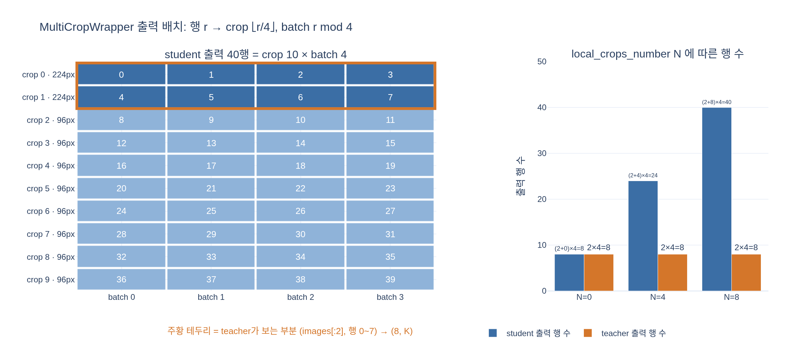

# batch=4, global 2 + local 8일 때 student 출력 shape은?

`(40, K)`. crop $(2+8)$ 개 × 배치 $4$ = 40행이고 각 행이 $K$차원 로짓이다.
teacher는 `images[:2]` 만 통과시켜 $(8, K)$ 를 낸다.

실행 가능한 예제는 [`expy.py`](expy.py) (jupyter percent 스크립트) 참고.

## 시각화

