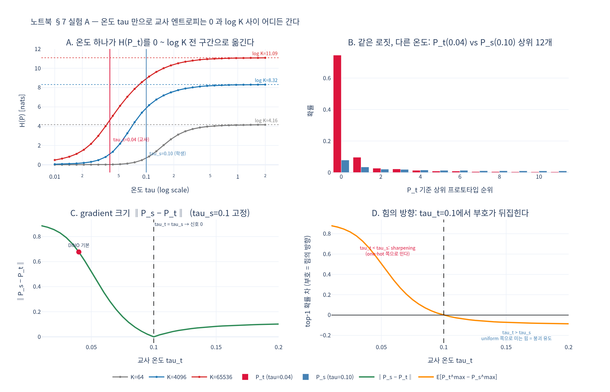

# 노트북 §7 실험 A는 무엇을 보여주는가?

실험 A는 **온도 $\tau$ 하나만으로 교사 분포의 엔트로피 $H(P_t)$ 가 $0$ 과 $\log K$ 사이 어디든 갈 수 있음**을 보여준다.
로짓 $z$ 는 전혀 바꾸지 않고 $\tau$ 만 움직여도 분포가 one-hot(저온)에서 uniform(고온)까지 연속으로 이동한다.

그래서 DINO는 $\tau_t = 0.04 < \tau_s = 0.1$ 이라는 **부등호**를 못박는다.
교사가 학생보다 항상 더 확신하게 만들어 gradient $\propto P_s - P_t$ 를 살려 두는 것이 학습 신호의 원천이고,
두 온도가 같으면 $P_t = P_s$ 가 되어 신호가 정확히 $0$ 이 된다.

- `expy.py` — 실험 A를 독립 실행 가능하게 재현한 jupyter percent 스크립트 (`python3 expy.py`)

## 시각화

