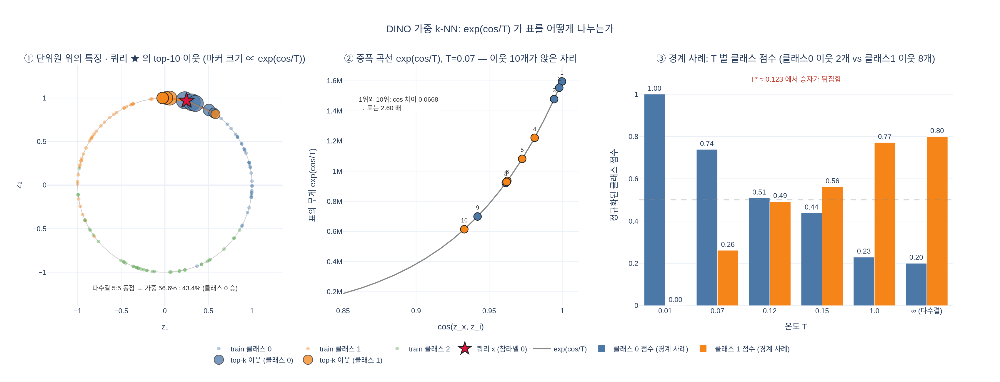

# DINO의 k-NN 분류 예측 식

> **Q.** DINO의 k-NN 분류 예측 식은?
>
> **A.** $$\hat{y}(x) = \arg\max_c \sum_{i\in\mathcal{N}_k(x)} \mathbb{1}[y_i = c]\cdot\exp\!\left(\frac{\cos(z_x, z_i)}{T}\right)$$ 이며 온도 $T = 0.07$이다.

- [`hi.md`](hi.md) — 고교 수학에서 출발해 다수결 k-NN → 코사인 유사도 → 지수 가중 → $T$의 역할까지 단계별 설명
- [`expy.py`](expy.py) — 2D 합성 데이터로 식을 한 줄씩 재현하고 `eval_knn.py`의 `knn_classifier`와 결과 일치를 확인하는 실행 가능한 노트북

## 시각화

