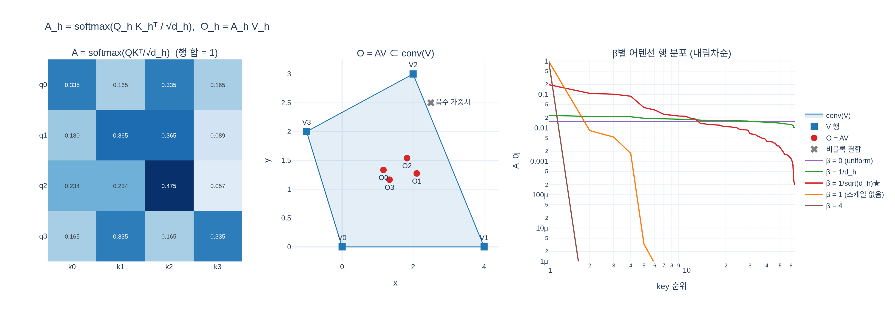

# 어텐션 행렬 $A_h$ 와 head 출력 $O_h$

## 답

$$
A_h = \mathrm{softmax}\!\left(\frac{Q_hK_h^\top}{\sqrt{d_h}}\right) \in \mathbb{R}^{N\times N},
\qquad O_h = A_hV_h \in \mathbb{R}^{N\times d_h}
$$

$A_h$ 의 **각 행은 합이 1인 확률분포**다.

여기서 $Q_h = ZW_h^Q,\ K_h = ZW_h^K,\ V_h = ZW_h^V$ 이고, $Z \in \mathbb{R}^{N\times D}$ 는 입력 토큰,
$d_h = D/\text{heads}$ 는 head 차원이다. head 를 다 붙이면

$$
\mathrm{MHSA}(Z) = \big[O_1 \Vert \cdots \Vert O_{\text{heads}}\big]\,W^O
$$

---

## 1. $Q_hK_h^\top$ 이 만드는 $N\times N$ 행렬의 의미

$Q_h$ 는 $(N \times d_h)$, $K_h^\top$ 은 $(d_h \times N)$ 이므로 곱은 $(N \times N)$ 이다.
차원 $d_h$ 가 사라지고 **토큰 수 $N$ 이 양쪽에 남는다** — 이게 어텐션의 핵심이다.

| 축 | 의미 |
|---|---|
| 행 $i$ | **query** 토큰 $i$ — "내가 무엇을 찾는가" |
| 열 $j$ | **key** 토큰 $j$ — "나는 무엇을 제공하는가" |
| 원소 $(i,j)$ | $q_i^\top k_j$ — 토큰 $i$ 의 질의와 토큰 $j$ 의 색인이 얼마나 맞는지 나타내는 **로짓(raw score)** |

즉 이 행렬은 "**모든 토큰 쌍의 궁합표**"다. ViT-S/16, 224px 라면 $N = 14^2+1 = 197$ 이므로
head 마다 $197\times197$ 표가 생긴다.

**비대칭이다.** $q_i^\top k_j \ne q_j^\top k_i$ 이다 ($W^Q \ne W^K$ 이므로). "$i$ 가 $j$ 를 보는 정도"와
"$j$ 가 $i$ 를 보는 정도"는 다른 값이다.

### $\sqrt{d_h}$ 로 나누는 이유

$q, k$ 의 성분이 독립이고 분산 1이면 $q^\top k = \sum_{c=1}^{d_h} q_ck_c$ 의 분산이 $d_h$ 에 비례한다
(표준편차 $\approx \sqrt{d_h}$). 스케일링 없이 softmax 에 넣으면 $d_h$ 가 커질수록 로짓 격차가 커져
분포가 one-hot 으로 **포화**되고, softmax 의 gradient $A_{ij}(\delta_{jk} - A_{ik})$ 가 0 으로 죽는다.
$1/\sqrt{d_h}$ 를 곱하면 로짓의 표준편차가 다시 $\approx 1$ 로 돌아온다.

DINO 코드는 이걸 `self.scale` 에 미리 넣어 둔다.

```python
head_dim = dim // num_heads
self.scale = qk_scale or head_dim ** -0.5      # = 1 / sqrt(d_h)
```

`vit_tiny/small/base` 세 팩토리 모두 **head_dim 은 항상 64** 로 고정이므로 `scale = 0.125` 다.

---

## 2. `softmax(dim=-1)` 은 행 단위 — 코드로 확인

DINO `vision_transformer.py` 의 `Attention.forward`:

```python
def forward(self, x):
    B, N, C = x.shape
    qkv = self.qkv(x).reshape(B, N, 3, self.num_heads, C // self.num_heads).permute(2, 0, 3, 1, 4)
    q, k, v = qkv[0], qkv[1], qkv[2]              # 각각 (B, heads, N, d_h)

    attn = (q @ k.transpose(-2, -1)) * self.scale # (B, heads, N, N)  ← Q_h K_h^T / sqrt(d_h)
    attn = attn.softmax(dim=-1)                   # ★ 마지막 축 = key 축 → 행 단위 정규화
    attn = self.attn_drop(attn)

    x = (attn @ v).transpose(1, 2).reshape(B, N, C)  # O_h = A_h V_h, 그다음 head concat
    x = self.proj(x)                                 # W^O
    x = self.proj_drop(x)
    return x, attn                                   # ★ 어텐션 맵을 항상 함께 반환
```

`attn` 의 shape 는 $(B, \text{heads}, N, N)$ 이고 **마지막 축이 key 축**이다.
따라서 `softmax(dim=-1)` 은 "고정된 query 행 안에서 모든 key 에 대해 정규화"다.

$$
A_{ij} = \frac{\exp(q_i^\top k_j/\sqrt{d_h})}{\sum_{j'=1}^{N}\exp(q_i^\top k_{j'}/\sqrt{d_h})}
$$

`dim=0` 이나 `dim=-2` 로 하면 열 정규화가 되어 완전히 다른(그리고 의미 없는) 연산이다.

### 구현상 주목할 점

- $Q,K,V$ 를 **선형층 하나**(`nn.Linear(dim, dim*3)`)로 한 번에 뽑아 GEMM 한 번으로 처리한다.
  `reshape` → `permute(2,0,3,1,4)` 로 $(3, B, \text{heads}, N, d_h)$ 를 만들어 q/k/v 를 분리한다.
- **`return x, attn`** 이 DINO 특유의 선택이다. 어텐션 시각화가 이 저장소의 대표 산출물이라
  일부러 남겼고, 대가로 `F.scaled_dot_product_attention`(FlashAttention)을 쓸 수 없어
  $(B, \text{heads}, N, N)$ 행렬이 **항상 메모리에 올라간다**.
  ViT-S/8 480px 라면 $N = 3601$, head 6개 → 배치 1장에 fp32 297MB. patch 8 + 큰 이미지에서
  OOM 이 나는 이유다.

---

## 3. 행 합이 정확히 1

softmax 의 정의상 각 행은

$$
A_{ij} \ge 0 \quad \forall i,j, \qquad \sum_{j=1}^{N} A_{ij} = 1 \quad \forall i
$$

를 만족한다. 그래서 $A_h$ 의 행 $i$ 는 "**토큰 $i$ 가 각 토큰에 얼마나 주의를 주는가**"라는
$N$ 개 항목의 확률분포로 읽힌다. 행렬 전체로는 **right stochastic matrix**(행 확률행렬)다.

주의할 점:

- **열 합은 1이 아니다.** $\sum_i A_{ij}$ 는 "토큰 $j$ 가 전체적으로 얼마나 인기 있는가"로
  임의의 양수 값이다 (예제에서 0.65 ~ 1.34).
- **`attn_drop` 을 켜면 행 합이 깨진다.** DINO 기본값은 `attn_drop=0.` 이고, 팩토리도
  이 값을 건드리지 않으므로 실제로는 항등이다.
- **부동소수 오차**로 1.0 에서 $10^{-7}$ 정도 벗어날 수 있다. `A.sum(-1)` 이 `0.99999988` 로
  찍히는 건 정상이다.

---

## 4. $O_h = A_hV_h$ 는 value 벡터들의 볼록결합

행 단위로 풀어 쓰면

$$
O_i = \sum_{j=1}^{N} A_{ij} V_j, \qquad A_{ij}\ge 0,\ \sum_j A_{ij}=1
$$

가중치가 **음이 아니고 합이 1** — 이게 바로 **볼록결합(convex combination)** 의 정의다.
따라서:

> 출력 토큰 $O_i$ 는 반드시 $\{V_1,\dots,V_N\}$ 의 **convex hull 안**에 있다.

의미론적으로 중요한 결론이 몇 개 나온다.

1. **어텐션은 새 정보를 만들지 않는다.** 이미 있는 value 벡터들을 *섞기만* 한다.
   새로운 방향으로 나가는 건 그 뒤의 $W^O$ 와 MLP 의 몫이다.
2. **자동으로 크기가 안정된다.** $\|O_i\| \le \max_j \|V_j\|$ (norm 은 볼록함수 → Jensen).
   value 가 폭발하지 않는 한 출력도 폭발하지 않는다.
3. **극단은 one-hot 일 때만.** $A_i$ 가 one-hot 이면 $O_i = V_{j^\*}$ 로 hull 의 꼭짓점에 닿고,
   uniform 이면 $O_i$ = value 들의 무게중심이다. 실제 어텐션은 그 사이에 있다.
4. 합이 1이더라도 **음수 가중치가 섞이면**(아핀결합) hull 을 벗어난다. softmax 가 음수를
   만들 수 없다는 점이 hull 을 보장하는 유일한 근거다.

`expy.py` 는 $d_h=2$ 로 잡아 이걸 평면에서 눈으로 보여준다 — $V$ 의 4개 점이 만드는 사각형
안에 $O$ 의 4개 점이 들어가고, 음수 가중치 대조군만 밖으로 나간다.

---

## 5. CLS 행이 시각화에 쓰이는 이유

DINO 의 대표 그림(물체 경계를 짚어내는 어텐션 맵)은 $A_h$ 의 **0번째 행**만 쓴다.

```python
a = model.get_last_selfattention(img)   # (B, heads, N, N)
cls_attn = a[0, :, 0, 1:]               # ★ 0번째 행, CLS→CLS 제외 → (heads, N-1)
cls_map = cls_attn.reshape(nh, w, w)    # 패치 격자로 되돌림
```

이유:

- **행이어야 확률분포다.** $A_h[0,:]$ 는 합이 1인 분포라 "비중"으로 읽고 색으로 칠할 수 있다.
  열 $A_h[:,0]$ 은 정규화 대상이 아니어서 합이 1이 아니고, 스케일이 head/이미지마다 달라
  비교가 안 된다.
- **CLS 가 이미지 표현이다.** `VisionTransformer.forward` 는 CLS 토큰을 그대로 내보낸다.
  그러니 CLS 행은 "**최종 이미지 표현이 어느 패치에서 왔는가**"를 그대로 알려준다.
  다른 행(패치 $i$ 의 행)은 "그 패치가 무엇을 참조했는가"로 국소적이라 전체 그림이 안 나온다.
- **패치 축이 2D 격자로 복원된다.** 열 인덱스 1..N-1 이 패치 순서 그대로라
  $(\sqrt{N-1}, \sqrt{N-1})$ 로 reshape 하면 바로 이미지 좌표다.

`[:, 1:]` 로 CLS→CLS 성분을 빼기 때문에 **잘라낸 뒤의 합은 1보다 작다** (예제에서 0.79~0.82).
그래서 시각화 코드는 필요하면 다시 정규화하거나, 상위 몇 %만 남기는 threshold 를 쓴다.

정량 지표로는 CLS 행의 엔트로피를 본다.

$$
H(a^{(h)}) = -\sum_{i} \hat a^{(h)}_i \log \hat a^{(h)}_i, \qquad
\hat a^{(h)} = \frac{a^{(h)}}{\sum_i a^{(h)}_i}
$$

랜덤 초기화는 모든 패치를 고르게 보므로 $H \approx \log N$ 이고, 사전학습 모델은 물체에
집중하므로 $H$ 가 확실히 낮다. $\exp(H)$ 를 "유효 참조 토큰 수"로 읽으면 편하다.

또한 `get_last_selfattention` 은 마지막 블록만 `return_attention=True` 로 호출하므로
**마지막 블록의 출력은 계산되지 않는다** — 어텐션까지만 구하고 반환한다.

---

## 6. shape 추적

$B$ = 배치, $N$ = 토큰 수, $D$ = embed_dim, $d_h = D/\text{heads}$.
아래는 ViT-Tiny ($D=192$, heads=3, $d_h=64$), $B=2$, $N=5$ 실측값이다.

| 단계 | 수식 | shape | 실측 |
|---|---|---|---|
| 입력 | $Z$ | $(B, N, D)$ | (2, 5, 192) |
| `qkv(x)` | — | $(B, N, 3D)$ | (2, 5, 576) |
| reshape + `permute(2,0,3,1,4)` | — | $(3, B, \text{heads}, N, d_h)$ | (3, 2, 3, 5, 64) |
| `q, k, v` | $Q_h, K_h, V_h$ | $(B, \text{heads}, N, d_h)$ | (2, 3, 5, 64) |
| `q @ k.transpose(-2,-1) * scale` | $Q_hK_h^\top/\sqrt{d_h}$ | $(B, \text{heads}, N, N)$ | (2, 3, 5, 5) |
| `softmax(dim=-1)` | $A_h$ | $(B, \text{heads}, N, N)$ | (2, 3, 5, 5) |
| `attn @ v` | $O_h = A_hV_h$ | $(B, \text{heads}, N, d_h)$ | (2, 3, 5, 64) |
| `transpose(1,2).reshape` | head concat | $(B, N, D)$ | (2, 5, 192) |
| `proj` | $W^O$ | $(B, N, D)$ | (2, 5, 192) |

핵심은 두 개의 shape 전환이다.

- $d_h$ 를 **contract** 해서 $(N,N)$ 을 만든다 → 토큰끼리 섞는 정보가 여기 다 있다.
- $A_hV_h$ 에서 $N$ 을 다시 **contract** 해서 $(N, d_h)$ 로 돌아온다 → 출력 토큰 수가 유지된다.

`transpose(1, 2)` 가 필요한 이유: `attn @ v` 는 $(B, \text{heads}, N, d_h)$ 인데 head 축이
$N$ 앞에 있어서 그대로 reshape 하면 **토큰이 아니라 head 가 붙어버린다**. head 축을 $N$ 뒤로
옮긴 뒤 마지막 두 축을 합쳐야 "각 토큰마다 head 출력을 이어붙인" $[O_1\Vert\cdots\Vert O_{\text{heads}}]$
가 된다.

---

## 7. 한 줄 정리

| 기호 | 정체 |
|---|---|
| $Q_hK_h^\top/\sqrt{d_h}$ | $(N\times N)$ 로짓. 행=query, 열=key, 원소=궁합 점수. $1/\sqrt{d_h}$ 는 포화 방지 |
| $A_h$ | 그 로짓을 **행 단위** softmax. 행 합 = 1, 원소 $\ge 0$ → 행 확률행렬 |
| $O_h = A_hV_h$ | 각 출력 토큰 = value 벡터들의 **볼록결합** → 항상 $\mathrm{conv}(V)$ 안 |
| $A_h[0,:]$ | CLS 행. "이미지 표현이 어느 패치에서 왔는가" → 시각화의 출발점 |

## 시각화


