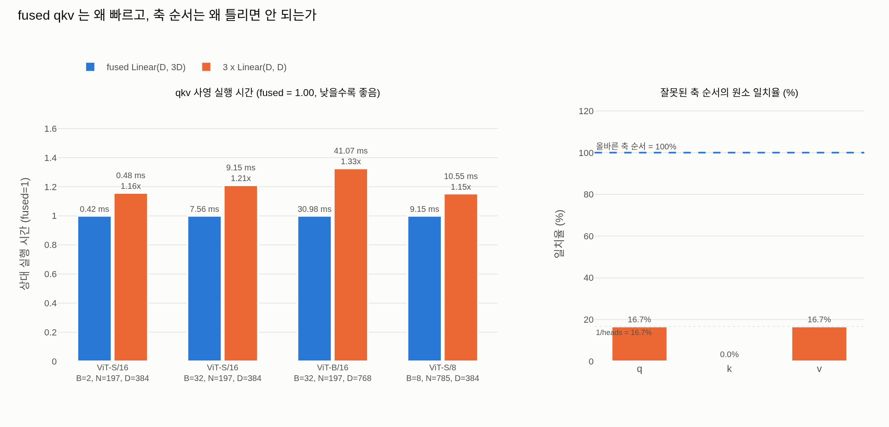

# DINO `Attention` 의 Q/K/V 계산: fused `Linear(D, 3D)` + `reshape`/`permute`

## 1. 실제 코드

`/home/sungwoo/projects/swcho/dino/vision_transformer.py` 의 `Attention` (68–92행):

```python
class Attention(nn.Module):
    def __init__(self, dim, num_heads=8, qkv_bias=False, qk_scale=None, attn_drop=0., proj_drop=0.):
        super().__init__()
        self.num_heads = num_heads
        head_dim = dim // num_heads
        self.scale = qk_scale or head_dim ** -0.5

        self.qkv = nn.Linear(dim, dim * 3, bias=qkv_bias)   # ★ 하나로 합친 층
        self.attn_drop = nn.Dropout(attn_drop)
        self.proj = nn.Linear(dim, dim)
        self.proj_drop = nn.Dropout(proj_drop)

    def forward(self, x):
        B, N, C = x.shape
        qkv = self.qkv(x).reshape(B, N, 3, self.num_heads, C // self.num_heads).permute(2, 0, 3, 1, 4)
        q, k, v = qkv[0], qkv[1], qkv[2]
        ...
```

핵심 두 줄만 다시 보면:

```python
qkv = self.qkv(x).reshape(B, N, 3, self.num_heads, C // self.num_heads).permute(2, 0, 3, 1, 4)
q, k, v = qkv[0], qkv[1], qkv[2]
```

## 2. 각 축의 의미를 하나씩 대응시키기

기호를 먼저 고정한다.

| 기호 | 뜻 | ViT-S/16, 224px 예 |
|---|---|---|
| $B$ | 배치 크기 | 임의 |
| $N$ | 토큰 수 = 패치 수 + 1(CLS) | $14^2 + 1 = 197$ |
| $C = D$ | 임베딩 차원 | 384 |
| `num_heads` | head 수 | 6 |
| $d_h$ = `C // num_heads` | head 하나의 차원 | 64 |

### 2-1. `self.qkv(x)`

$$
X \in \mathbb{R}^{B \times N \times D}
\;\longrightarrow\;
\text{qkv}(X) = X (W^{qkv})^{\top} + b^{qkv} \in \mathbb{R}^{B \times N \times 3D}
$$

`nn.Linear` 는 **마지막 축에만** 작용하므로 $B, N$ 은 그대로 통과한다.
`self.qkv.weight` 의 shape 은 $(3D, D)$, `self.qkv.bias` 는 $(3D,)$ 다.

### 2-2. `.reshape(B, N, 3, num_heads, d_h)`

마지막 축 $3D$ 를 세 조각으로 **쪼개기만** 한다 (데이터 이동 없음, 순전히 뷰 재해석):

$$
3D \;=\; \underbrace{3}_{\text{q/k/v}} \times \underbrace{\text{heads}}_{h} \times \underbrace{d_h}_{\text{head 내부 좌표}}
$$

| 축 | 크기 | 의미 |
|---|---|---|
| 0 | `B` | 배치(이미지) 인덱스 |
| 1 | `N` | 토큰 인덱스 (0 = CLS) |
| 2 | `3` | **q=0, k=1, v=2** — 어떤 사영인가 |
| 3 | `num_heads` | 몇 번째 head 인가 |
| 4 | `d_h` | 그 head 안에서의 채널 좌표 |

여기서 축 순서가 `(3, heads, d_h)` 인 것이 **자유 선택이 아니다.**
`reshape` 은 row-major(C-order) 로 평평한 인덱스를 나눈다. 즉 마지막 축의 평평한 좌표
$c \in [0, 3D)$ 는

$$
c = t\cdot(\text{heads}\cdot d_h) + h\cdot d_h + j
\qquad (t \in \{0,1,2\},\; h < \text{heads},\; j < d_h)
$$

로 분해된다. 그리고 `Linear(D, 3D)` 의 출력 채널은 정의상
`[0:D]` = q, `[D:2D]` = k, `[2D:3D]` = v 로 배치되므로, **가장 느리게 변하는 좌표 $t$ 가 정확히 q/k/v 선택자**가 된다.
그래서 `3` 이 `num_heads` 보다 **앞**에 와야 한다. (뒤에 놓으면 값이 섞인다 — §5)

### 2-3. `.permute(2, 0, 3, 1, 4)`

`permute` 는 축 순서만 바꾼다. 입력 축 인덱스를 나열하는 형식이므로,

```
입력 축:   0=B    1=N    2=3    3=heads   4=d_h
permute(2, 0, 3, 1, 4)
출력 축:   0←2    1←0    2←3    3←1       4←4
결과:      (3,    B,     heads, N,        d_h)
```

$$
(B, N, 3, \text{heads}, d_h) \;\xrightarrow{\ \text{permute}(2,0,3,1,4)\ }\; (3,\, B,\, \text{heads},\, N,\, d_h)
$$

### 2-4. `q, k, v = qkv[0], qkv[1], qkv[2]`

첫 축을 인덱싱하면 각각

$$
q, k, v \in \mathbb{R}^{B \times \text{heads} \times N \times d_h}
$$

가 나온다. 이 세 개는 새 텐서가 아니라 같은 저장소를 보는 **뷰(view)** 다 (복사 없음).

## 3. 왜 하필 `(3, B, heads, N, d_h)` 순서인가

두 가지 목적이 동시에 만족되는 유일한 배치다.

**(a) 첫 축으로 q/k/v 를 꺼내기 위해.**
`qkv[0]` 처럼 leading 축을 인덱싱하는 것은 stride 계산만 바꾸는 O(1) 슬라이스다.
만약 q/k/v 축이 중간에 있으면 `qkv[:, :, 0]` 같은 식으로 꺼내야 하고,
그렇게 얻은 뷰는 뒤 연산에서 비연속(non-contiguous)이 되어 암묵적 복사를 유발하기 쉽다.

**(b) 배치·head 를 앞으로 몰아 "배치 matmul" 을 만들기 위해.**
PyTorch `@`(`torch.matmul`) 는 **마지막 두 축을 행렬로 보고, 앞의 모든 축을 배치 차원으로 브로드캐스트**한다.
$q, k, v$ 가 $(B, \text{heads}, N, d_h)$ 이므로 뒤이은 코드가 루프 없이 그대로 돌아간다:

```python
attn = (q @ k.transpose(-2, -1)) * self.scale   # (B, heads, N, dh) @ (B, heads, dh, N) → (B, heads, N, N)
attn = attn.softmax(dim=-1)
x = (attn @ v).transpose(1, 2).reshape(B, N, C) # (B, heads, N, dh) → (B, N, heads, dh) → (B, N, C)
```

$B \times \text{heads}$ 개의 독립적인 $N \times d_h$ 행렬곱이 한 번의 batched GEMM 으로 처리된다.
head 별 for-loop 이 코드에 없는 이유가 바로 이 축 순서다.

마지막 줄의 `transpose(1, 2).reshape(B, N, C)` 는 **역연산**이다:
$(B,\text{heads},N,d_h) \to (B,N,\text{heads},d_h) \to (B,N,D)$ — 즉 수식의 head concat
$[O_1 \Vert \cdots \Vert O_{\text{heads}}]$ 이 `reshape` 한 줄로 표현된다.
`heads` 와 $d_h$ 가 인접해 있고 이 순서여야 concat 의 채널 배치와 맞는다.

> 참고: `permute` 후 텐서는 비연속이다. 그래서 `x = (attn @ v).transpose(1,2).reshape(...)` 에서
> `view` 가 아니라 `reshape` 를 쓴다 (`view` 는 비연속 텐서에서 에러가 난다).

## 4. 왜 `Linear(D, 3D)` 하나인가 — 세 개의 `Linear(D, D)` 대신

### 4-1. 수학적으로는 완전히 동등하다

$$
W^{qkv} = \begin{bmatrix} W^{q} \\ W^{k} \\ W^{v} \end{bmatrix} \in \mathbb{R}^{3D \times D},
\qquad
b^{qkv} = \begin{bmatrix} b^{q} \\ b^{k} \\ b^{v} \end{bmatrix} \in \mathbb{R}^{3D}
$$

이므로

$$
X (W^{qkv})^{\top} + b^{qkv}
= \big[\, X (W^{q})^{\top} + b^{q} \;\big\Vert\; X (W^{k})^{\top} + b^{k} \;\big\Vert\; X (W^{v})^{\top} + b^{v} \,\big]
$$

파라미터 개수도 같다: $3D^2$ (+bias $3D$). 워크스루가 이 동등성을 그대로 써서
가중치에서 손으로 수식을 재현한다:

```python
Wqkv, bqkv = attn_mod.qkv.weight, attn_mod.qkv.bias   # (3D, D), (3D,)
Wq, Wk, Wv = Wqkv.split(D, dim=0)
bq, bk, bv = bqkv.split(D, dim=0)
Q = z @ Wq.t() + bq          # (1, N, D)
```

즉 fused 층은 **세 개의 `Linear(D, D)` 를 행 방향으로 이어붙인 것**이고, 반대로 `split(D, dim=0)`
으로 언제든 세 덩어리로 되돌릴 수 있다. (사전학습 체크포인트를 timm/HF 등 분리형 구현으로 옮길 때
쓰는 변환이 정확히 이것이다.)

### 4-2. 그런데 왜 합치는가 — 성능

동등한데도 합치는 이유는 전부 실행 효율이다.

1. **GEMM 1회.** $(BN \times D) \times (D \times 3D)$ 한 번이
   $(BN \times D) \times (D \times D)$ 세 번보다 낫다. FLOPs 총량은 같지만,
   출력 차원이 3배 큰 하나의 GEMM 은 **arithmetic intensity 가 높다** — 입력 $X$ 를
   한 번만 읽어 세 배의 일을 한다. 세 번 나눠 하면 $X$ 를 세 번 읽는다(메모리 대역폭 3배).
2. **커널 런치 오버헤드 절감.** GPU 에서 커널 런치는 건당 수 µs 다. Attention 층마다
   3회 → 1회면 12블록 × 배치마다 수십 회의 런치가 사라진다. 작은 배치·짧은 시퀀스에서
   병목이 커널 런치인 경우 체감 차이가 크다.
3. **더 나은 타일링/점유율.** $D \times 3D$ 쪽이 cuBLAS 가 큰 타일을 쓰기에 충분히 커서
   SM 점유율이 올라간다. $D=384$ 같은 작은 행렬 세 개는 GPU 를 다 못 채운다.
4. **bias 도 한 번에.** epilogue 의 bias add 가 3회 → 1회.
5. **파라미터/옵티마이저 상태가 텐서 하나.** state dict 항목이 줄고, weight decay·
   grad clipping·all-reduce 도 큰 텐서 하나에 대해 도는 편이 유리하다.

> 절약되는 것은 FLOPs 가 아니라 **메모리 트래픽과 런치 횟수**다. 그래서 이득의 크기는
> 하드웨어·크기에 따라 다르고, CPU 소형 텐서에서는 차이가 작거나 노이즈에 묻힐 수도 있다
> (`expy.py` 의 벤치마크가 그 점을 실측한다).

## 5. `qkv_bias` 처리

```python
self.qkv = nn.Linear(dim, dim * 3, bias=qkv_bias)
```

- 클래스 **기본값은 `qkv_bias=False`** 다. 그런데 `vit_small` / `vit_base` 같은
  팩토리 함수는 모두 `qkv_bias=True` 를 넘긴다 — 즉 실제 DINO 모델은 항상 bias 가 있다.
  (기본값만 보고 "DINO 는 bias 없다" 고 결론내면 틀린다.)
- `True` 면 bias 는 shape $(3D,)$ 하나이고, 분리형 구현의 $b^q, b^k, b^v$ 를
  이어붙인 것과 같다 (`bqkv.split(D, dim=0)`).
- `False` 면 `self.qkv.bias is None` 이고, 분리형으로 옮길 때 세 `Linear` 도 모두
  `bias=False` 여야 동등하다.
- 세부: q 의 bias 는 attention 로짓에 $b^q K_h^\top$ 만큼 기여하는데 이는 행마다 상수가
  아니라서 softmax 에서 상쇄되지 않는다. 반면 k 의 bias 는 각 행에 **토큰과 무관한 상수**를
  더하는 항을 만들지 않으므로 역시 남는다. 그래서 일부 구현(예: T5 계열, 일부 LLM)이
  `bias=False` 를 선호하지만 ViT/DINO 는 timm 관례대로 `True` 를 쓴다.
- `self.proj = nn.Linear(dim, dim)` 의 bias 는 **`qkv_bias` 와 무관하게 항상 켜져 있다.**

파라미터 총계:
$$
\underbrace{3D^2 + 3D}_{\text{qkv}} + \underbrace{D^2 + D}_{\text{proj}} = 4D^2 + 4D
$$

## 6. 한눈에 보는 전체 흐름 (ViT-S/16, B=2)

```
x                                        (2, 197, 384)
└─ qkv: Linear(384 → 1152)               (2, 197, 1152)     ← GEMM 1회
   └─ reshape(2, 197, 3, 6, 64)          (2, 197, 3, 6, 64) ← 뷰 재해석만
      └─ permute(2, 0, 3, 1, 4)          (3, 2, 6, 197, 64) ← stride 재배열만
         ├─ qkv[0] = q                   (2, 6, 197, 64)
         ├─ qkv[1] = k                   (2, 6, 197, 64)
         └─ qkv[2] = v                   (2, 6, 197, 64)
            └─ q @ k^T * scale           (2, 6, 197, 197)   ← batched GEMM
               └─ softmax(-1) @ v        (2, 6, 197, 64)
                  └─ transpose(1,2).reshape  (2, 197, 384)  ← head concat
                     └─ proj: Linear(384 → 384)  (2, 197, 384)
```

`reshape` 과 `permute` 는 **연산이 아니라 메타데이터 조작**이다 — 실제 계산은
`qkv`(GEMM 1회), `q@k^T`, `attn@v`, `proj` 네 곳뿐이다.

## 7. 흔한 함정

- **축 순서를 바꿔 쓰기.** `reshape(B, N, num_heads, 3, d_h)` 로 쓰면 shape 은 통하지만
  q/k/v 가 head 별로 잘게 섞인다. §2-2 의 인덱스 식에서 $t$ 가 더 이상 최상위 좌표가
  아니기 때문이다. `expy.py` 가 이 반례를 수치로 보여준다.
- **`view` vs `reshape`.** `permute` 뒤에는 반드시 `reshape`(또는 `contiguous().view()`).
- **`transpose(-2, -1)` vs `.T`.** 4-D 텐서에서 `.T` 는 전체 축 반전이라 다른 결과가 된다.
  코드가 `k.transpose(-2, -1)` 를 쓰는 이유.
- **FlashAttention 을 쓸 수 없다.** DINO 의 `Attention.forward` 는 `(x, attn)` 튜플을
  반환한다 — 어텐션 맵 시각화가 이 저장소의 핵심 산출물이라 일부러 남긴 선택이다.
  대가로 `F.scaled_dot_product_attention` 을 쓰지 못하고 $(B, \text{heads}, N, N)$
  행렬이 항상 메모리에 올라간다 (ViT-S/8, 480px 면 배치 1장에 수백 MB).

## 시각화


