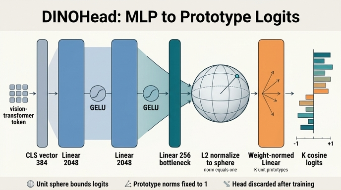

# `DINOHead`의 구조

## 한 줄 답

`Linear(in_dim, 2048)` → GELU → `Linear(2048, 2048)` → GELU → `Linear(2048, 256)` 의 3층 MLP, 그 출력에 **L2 정규화**, 마지막에 `weight_norm(Linear(256, out_dim, bias=False))`.

backbone $f_\theta$ 가 CLS 벡터를 뽑으면, head $h_\theta$ 가 그것을 $K$개 프로토타입에 대한 로짓으로 바꾼다. DINO에서 실제로 손실을 계산하는 대상은 이 head의 출력이다.

---

## 1. 실제 코드 (`/home/sungwoo/projects/swcho/dino/vision_transformer.py:257`)

```python
class DINOHead(nn.Module):
    def __init__(self, in_dim, out_dim, use_bn=False, norm_last_layer=True,
                 nlayers=3, hidden_dim=2048, bottleneck_dim=256):
        super().__init__()
        nlayers = max(nlayers, 1)
        if nlayers == 1:
            self.mlp = nn.Linear(in_dim, bottleneck_dim)
        else:
            layers = [nn.Linear(in_dim, hidden_dim)]
            if use_bn:
                layers.append(nn.BatchNorm1d(hidden_dim))
            layers.append(nn.GELU())
            for _ in range(nlayers - 2):
                layers.append(nn.Linear(hidden_dim, hidden_dim))
                if use_bn:
                    layers.append(nn.BatchNorm1d(hidden_dim))
                layers.append(nn.GELU())
            layers.append(nn.Linear(hidden_dim, bottleneck_dim))
            self.mlp = nn.Sequential(*layers)
        self.apply(self._init_weights)
        self.last_layer = nn.utils.weight_norm(nn.Linear(bottleneck_dim, out_dim, bias=False))
        self.last_layer.weight_g.data.fill_(1)
        if norm_last_layer:
            self.last_layer.weight_g.requires_grad = False

    def _init_weights(self, m):
        if isinstance(m, nn.Linear):
            trunc_normal_(m.weight, std=.02)
            if isinstance(m, nn.Linear) and m.bias is not None:
                nn.init.constant_(m.bias, 0)

    def forward(self, x):
        x = self.mlp(x)
        x = nn.functional.normalize(x, dim=-1, p=2)
        x = self.last_layer(x)
        return x
```

### 기본값과 `main_dino.py` 의 실제 사용

| 인자 | 기본값 | `main_dino.py` 에서 |
|---|---|---|
| `nlayers` | `3` | 그대로 (3층) |
| `hidden_dim` | `2048` | 그대로 |
| `bottleneck_dim` | `256` | 그대로 |
| `out_dim` ($=K$) | 필수 | `--out_dim 65536` |
| `use_bn` | `False` | `--use_bn_in_head False` |
| `norm_last_layer` | `True` | `--norm_last_layer True` (student), teacher는 인자를 안 넘겨 기본 `True` |

student는 `norm_last_layer=args.norm_last_layer` 로 노출되지만 teacher는 `DINOHead(embed_dim, args.out_dim, args.use_bn_in_head)` 로만 만들어져 항상 기본값을 쓴다(`main_dino.py:183-191`).

---

## 2. `nlayers` 분기 — 3가지 경로

`nlayers = max(nlayers, 1)` 로 0이나 음수는 1로 클램프된다.

- **`nlayers == 1`**: MLP가 아예 없다. `self.mlp = nn.Linear(in_dim, bottleneck_dim)` — 384→256 단일 선형층. GELU도, 병목의 "좁아짐"도 없다.
- **`nlayers == 2`**: `Linear(in_dim, 2048)` → GELU → `Linear(2048, 256)`. 중간 루프(`range(nlayers - 2)` = 0회)가 돌지 않는다.
- **`nlayers == 3`(기본)**: 위 코드 그대로. 중간 루프가 1회 돌아 `Linear(2048,2048)` + GELU 가 한 번 삽입된다.

즉 히든층 개수는 `nlayers - 2` 개, 총 Linear 개수는 `nlayers` 개다. 마지막 `Linear(hidden_dim, bottleneck_dim)` 뒤에는 **GELU가 붙지 않는다** — 활성화 없이 바로 L2 정규화로 들어간다.

## 3. `use_bn` 분기

`use_bn=True` 면 각 히든 `Linear` 바로 뒤·GELU 앞에 `nn.BatchNorm1d(hidden_dim)` 이 들어간다.

```
Linear(384,2048) → BN1d(2048) → GELU → Linear(2048,2048) → BN1d(2048) → GELU → Linear(2048,256)
```

주의점:
- 병목층(`Linear(hidden_dim, bottleneck_dim)`) 뒤에는 BN이 없다.
- `nlayers == 1` 경로에는 BN이 전혀 관여하지 않는다.
- ViT 백본에서는 기본 `False`. `BatchNorm1d` 는 배치 통계에 의존해 multi-crop(10 crop을 배치축으로 이어붙임) 상황에서 통계가 섞이는 문제가 있고, DINO 논문은 "BN-free" 파이프라인을 ViT의 장점으로 강조한다. ResNet 백본을 쓸 때만 켜는 옵션에 가깝다.

## 4. `_init_weights`

```python
trunc_normal_(m.weight, std=.02)
nn.init.constant_(m.bias, 0)
```

모든 `nn.Linear` 를 $\mathcal{N}(0, 0.02^2)$ 절단정규로, bias는 0으로 초기화한다. `self.apply(self._init_weights)` 가 `last_layer` **생성 전에** 호출되므로 `last_layer` 는 이 초기화를 받지 않는다 — 순서가 중요하다. (`last_layer` 는 `nn.Linear` 의 기본 Kaiming-uniform 초기화 후 `weight_norm` 으로 $g, v$ 로 분해된다.)

부수 사실: DINO의 `utils.trunc_normal_` 은 `a=-2, b=2` 를 **절대 경계**로 쓰므로 `std=.02` 에서 $\pm100\sigma$ 에 놓여 실질적으로 절단이 일어나지 않는다.

## 5. `weight_norm` 과 `weight_g`

`nn.utils.weight_norm` 은 가중치 행렬의 각 행을 크기와 방향으로 재매개변수화한다.

$$
w_k = g_k \frac{v_k}{\lVert v_k \rVert}
$$

- `weight_v` : shape $(K, 256)$ — 방향 파라미터
- `weight_g` : shape $(K, 1)$ — 행별 크기(norm) 파라미터

DINO는 두 줄로 이것을 고정한다.

```python
self.last_layer.weight_g.data.fill_(1)          # 모든 행 노름을 1로
if norm_last_layer:
    self.last_layer.weight_g.requires_grad = False   # 학습에서 제외 → 영구히 1
```

`fill_(1)` 만으로는 "초기값이 1"일 뿐 학습하면 변한다. `requires_grad = False` 까지 있어야 학습 내내 $\lVert w_k \rVert = 1$ 이 유지된다. `norm_last_layer=False` 면 크기가 풀려 프로토타입별 스케일이 학습된다 — DINO 저자들은 **큰 배치를 쓰는 convnet 에서만** 풀기를 권하고, ViT에서는 학습 초기 불안정을 유발한다고 적어 두었다(`main_dino.py:57` 의 help 참고). `bias=False` 라서 로짓에 offset도 없다.

## 6. L2 정규화가 왜 **마지막 Linear 앞**에 오는가

`forward` 에서 정규화 위치가 핵심이다.

$$
u = \mathrm{MLP}(y), \qquad \tilde u = \frac{u}{\lVert u \rVert_2}, \qquad z_k = w_k^\top \tilde u
$$

입력이 단위벡터($\lVert \tilde u \rVert = 1$)이고 프로토타입도 단위벡터($\lVert w_k \rVert = 1$)이면

$$
z_k = w_k^\top \tilde u = \frac{v_k^\top \tilde u}{\lVert v_k \rVert} = \cos\angle(v_k, \tilde u) \in [-1, 1]
$$

**정규화를 마지막 Linear 뒤에 두면 이 성질이 성립하지 않는다** — 로짓 벡터 전체를 정규화하는 것은 프로토타입별 코사인이 아니다. 앞에 두어야 "단위구 위의 점 vs 단위구 위의 $K$개 방향" 이라는 기하가 만들어진다.

결과로 로짓 스케일이 구조적으로 $[-1,1]$ 에 묶인다. 어떤 프로토타입이 가중치 노름을 키워 softmax를 독식하는 경로가 원천 차단되므로, centering/sharpening 이전의 **붕괴 방지 "0번째 장치"** 역할을 한다. (로짓 = 코사인 유사도라는 결론 자체는 별도 카드 참조.)

실제 온도 스케일링은 여기가 아니라 `DINOLoss` 에서 `/ temp` 로 들어간다 — 로짓 범위가 $[-1,1]$ 이므로 $\tau \approx 0.04\text{–}0.1$ 같은 작은 온도가 의미를 갖는다.

## 7. 단계별 shape과 파라미터 수 (ViT-S: `in_dim=384`, `out_dim=65536`)

배치 $B$ 기준. multi-crop 이면 $B = \text{batch} \times \text{ncrops}$.

| # | 연산 | 출력 shape | 파라미터 수 | 계산식 |
|---|---|---|---|---|
| 0 | backbone CLS 출력 (입력) | $(B, 384)$ | — | — |
| 1 | `Linear(384, 2048)` | $(B, 2048)$ | **788,480** | $384{\times}2048 + 2048$ |
| 2 | `GELU` | $(B, 2048)$ | 0 | — |
| 3 | `Linear(2048, 2048)` | $(B, 2048)$ | **4,196,352** | $2048^2 + 2048$ |
| 4 | `GELU` | $(B, 2048)$ | 0 | — |
| 5 | `Linear(2048, 256)` | $(B, 256)$ | **524,544** | $2048{\times}256 + 256$ |
| 6 | `F.normalize(dim=-1, p=2)` | $(B, 256)$ | 0 | 노름 = 1 |
| 7 | `weight_norm(Linear(256, 65536, bias=False))` | $(B, 65536)$ | **16,842,752** | `weight_v` $256{\times}65536$ = 16,777,216 + `weight_g` 65,536 |
| | **합계** | | **22,352,128 (≈22.35M)** | MLP 5.51M + last_layer 16.84M |

`weight_g` 65,536개는 `norm_last_layer=True` 면 `requires_grad=False` 라 **학습 파라미터가 아니다** → 학습되는 건 ≈22.29M.

비교: ViT-S/16 backbone 이 21.7M 이므로 **head 하나가 backbone 만큼 무겁다**. 병목 이후 $256 \times K$ 층이 전체의 75%를 차지한다.

`out_dim` 을 줄이면 곧바로 가벼워진다:

| `out_dim` ($K$) | MLP | last_layer | 합계 |
|---|---|---|---|
| 4,096 | 5.51M | 1.05M | **6.56M** |
| 65,536 (기본) | 5.51M | 16.84M | **22.35M** |

## 8. 학습이 끝나면 head는 버린다

`DINOHead` 는 self-distillation 손실을 만들기 위한 **학습 전용 장치**다. 평가·전이 시점에는 backbone의 CLS 임베딩(ViT-S면 384차원)만 쓰고, head는 통째로 버린다.

- `main_dino.py` 는 `MultiCropWrapper(backbone, DINOHead(...))` 로 감싸 학습하지만,
- `eval_linear.py` / `eval_knn.py` 등은 `vit_small(num_classes=0)` 백본만 만들고 체크포인트에서 `backbone.` prefix 키만 로드한다.
- ViT 자체의 `self.head` 도 `num_classes=0` 이라 `nn.Identity` — DINO 백본에는 분류기가 없다.

$K = 65536$ 이라는 큰 출력 차원이 정당한 이유도 이것이다: 이 층은 "클래스 수"가 아니라 대비 학습용 프로토타입 사전이고, 버려질 것이므로 크게 잡아도 배포 비용이 없다.

---

## 정리 체크리스트

- 3층 MLP(`nlayers=3`), 히든 2048, 병목 256 — 마지막 Linear 뒤에 GELU 없음
- `use_bn=True` 면 히든 Linear 뒤·GELU 앞에 `BatchNorm1d` (기본 off)
- `nlayers==1` 이면 MLP 없이 `Linear(in_dim, 256)` 단일층
- `_init_weights` 는 `last_layer` 생성 **전에** apply → MLP만 `trunc_normal_(std=.02)`
- `weight_g.fill_(1)` + `norm_last_layer` 시 `requires_grad=False` → 프로토타입 노름 영구 1
- L2 정규화가 마지막 Linear **앞**에 있어야 로짓이 코사인 유사도가 된다
- 학습 후 head는 폐기, backbone CLS 임베딩만 사용

## 인포그래픽


