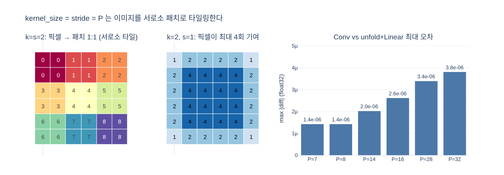

# `kernel_size = stride = P` 인 Conv2d가 패치 선형 투영과 같은 이유

## 카드 정리

**질문** — kernel_size = stride = $P$ 인 Conv2d가 패치 선형 투영과 같은 이유는?

**답** — 커널이 패치 경계에서 겹치지 않고 딱 맞아떨어지므로 각 출력 위치가 서로 겹치지 않는 패치 하나의 선형 변환이 된다. `F.unfold` + `Linear` 로 재현하면 오차 3e-06 수준으로 일치한다.

---

## 1. 논문이 말하는 패치 임베딩

ViT 논문(그리고 DINO)의 패치 임베딩은 이렇게 서술된다.

> 이미지를 $P\times P$ 패치로 자르고, 각 패치를 flatten 해서 학습 가능한 선형층 하나에 통과시킨다.

$$
z_p = W_e\,\mathrm{vec}(x_p) + b_e,
\qquad x_p \in \mathbb{R}^{C\times P\times P},
\quad W_e \in \mathbb{R}^{D \times CP^2},\quad b_e \in \mathbb{R}^{D}
$$

즉 **패치 하나 → 토큰 하나**이고, 모든 패치가 **같은** $W_e$ 를 쓴다.

## 2. DINO 구현은 Conv2d 한 줄

`vision_transformer.py` 의 `PatchEmbed` 전체가 이것뿐이다.

```python
self.proj = nn.Conv2d(in_chans, embed_dim, kernel_size=patch_size, stride=patch_size)

def forward(self, x):
    x = self.proj(x).flatten(2).transpose(1, 2)   # (B, N, D)
    return x
```

shape 변화:

$$
(B, 3, 224, 224)
\xrightarrow{\;\text{Conv}(k=s=16)\;} (B, D, 14, 14)
\xrightarrow{\;\text{flatten(2)}\;} (B, D, 196)
\xrightarrow{\;\text{transpose}\;} (B, 196, D)
$$

## 3. 왜 같은가 — 핵심 논리

Conv2d 의 출력 한 칸은 원래 **"커널이 덮은 영역과 커널 가중치의 내적"** 이다.

$$
y[d, i, j] \;=\; \sum_{c,u,v} W[d,c,u,v]\, x[c,\; s i + u,\; s j + v] \;+\; b[d]
$$

여기서 $s = k = P$ 를 넣으면 커널이 덮는 영역이

$$
[\,iP : (i{+}1)P\,) \times [\,jP : (j{+}1)P\,)
$$

가 되어, **$(i,j)$ 가 다르면 영역이 절대 겹치지 않고, 모든 픽셀이 정확히 한 번 쓰인다** (= 타일링, tiling). 그래서

- 출력 위치 $(i,j)$ $\leftrightarrow$ 서로소 패치 $x_{ij}$ 가 **1:1 대응**
- 그 위치의 $D$차원 벡터 = 그 패치 벡터 $\mathrm{vec}(x_{ij})$ 에 $W_e = $ `weight.reshape(D, -1)` 를 곱한 것

즉 위 합은 정확히 $W_e\,\mathrm{vec}(x_{ij}) + b_e$ 다. 슬라이딩 윈도우가 "이웃을 섞는" 성질이 stride 때문에 완전히 사라지고, 남는 것은 **채널 방향 선형 변환**뿐이다.

### 가중치 레이아웃까지 그대로 맞는 이유

`reshape` 하나로 끝나는 것은 우연이 아니다.

| | 메모리 순서 |
|---|---|
| Conv 커널 `weight` | `(D, C, P, P)` → 마지막 3축이 채널 → 행 → 열 |
| `F.unfold` 열 벡터 | 길이 $CP^2$, 역시 채널 → 행 → 열 |

두 레이아웃이 동일하므로 `proj.weight.reshape(D, -1)` 가 곧 논문의 $W_e$ 다. 별도 permute/transpose가 필요 없다.

## 4. 수치 검증 (asset의 §3 그대로)

```python
W_flat  = patch_embed.proj.weight.reshape(D, -1)               # (D, 3*P*P) = W_e
patches = F.unfold(x_img, kernel_size=P, stride=P)             # (B, 3*P*P, N)
manual  = patches.transpose(1, 2) @ W_flat.t() + proj.bias     # (B, N, D)

tokens  = patch_embed(x_img)                                   # Conv 경로
assert torch.allclose(manual, tokens, atol=1e-5)
# 최대 오차 2.7e-06  →  Conv2d(k=s=P) == 패치 flatten + Linear
```

- `F.unfold(kernel_size=P, stride=P)` 가 하는 일이 정확히 "겹치지 않는 패치를 벡터로 뽑기"다.
- 남는 $\sim3\times10^{-6}$ 오차는 **부동소수점 누적 순서 차이**뿐이다. 768항 내적을 cuDNN/GEMM 커널이 어떤 순서로 더하는지가 다르므로 float32 정밀도($\varepsilon \approx 1.2\times10^{-7}$)에 항수·크기를 곱한 만큼 어긋난다. 수학적으로는 완전히 동일한 연산이다.
- 실제로 `expy.py` 에서 $P$ 가 커지면(패치 벡터가 길어지면) 오차도 $1.4\times10^{-6} \to 3.8\times10^{-6}$ 으로 커지는데, 이것이 "정밀도 잡음"이라는 증거다.
- 파라미터 수도 정확히 같다: $D\cdot CP^2 + D$. vit_tiny(patch16) 기준 $192\times3\times16\times16 + 192 = 147{,}648$.

## 5. `kernel = stride` 조건이 깨지면

`expy.py` §3 실측 ($224\times224$, $k=16$):

| $k$ | $s$ | 출력 격자 | 픽셀 최대 기여 | 미사용 픽셀 | unfold+Linear 와의 오차 |
|---|---|---|---|---|---|
| 16 | 16 | 14×14 | 1 | 0 | 2.86e-06 (일치) |
| 16 | 8 | 27×27 | 4 | 0 | shape 불일치 |
| 16 | 32 | 7×7 | 1 | 37,632 | shape 불일치 |
| 16 | 15 | 14×14 | 4 | 5,655 | **3.34** (완전히 다름) |

- $s < k$ (겹침): 한 픽셀이 여러 출력에 기여 → 출력이 "패치 하나의 함수"가 아니게 되고 토큰 수도 달라진다.
- $s > k$ (구멍): 픽셀이 버려져 패치들이 이미지를 덮지 못한다.
- $s = 15$ 는 출력 격자가 우연히 14×14 로 같지만 값은 전혀 다르다 — **shape 일치는 동등성의 증거가 아니다.**
- 추가 조건으로 $P \mid H$ 가 필요하다. 출력 격자는 $\lfloor (H-k)/s \rfloor + 1$ 이고, 이것이 $H/P$ 와 같으려면 나눠떨어져야 한다.

## 6. 그럼 왜 Conv2d로 쓰나

동등하다면 굳이 Conv를 쓰는 이유는 순전히 **구현 효율**이다.

- cuDNN/GEMM 커널이 타일링 + 행렬곱을 한 번에 처리한다. `unfold` 로 $(B, CP^2, N)$ 중간 버퍼를 명시적으로 만들면 메모리 복사가 추가된다.
- 입력이 이미 `(B, C, H, W)` 이므로 reshape/permute 전처리가 필요 없다.
- 해상도가 바뀌어도 커널이 공유되므로 파라미터 수는 그대로고 토큰 수 $N$ 만 바뀐다 (DINO가 multi-crop, 즉 96px/224px 를 같은 backbone에 넣을 수 있는 이유).

개념적으로는 여전히 "패치 flatten + 선형층 하나"라고 읽으면 된다.

## 7. 곁들여 알아둘 함정

`PatchEmbed.proj` 는 `nn.Conv2d` 이므로 DINO의 `_init_weights` 분기(`isinstance(m, nn.Linear)` / `nn.LayerNorm`)에 **걸리지 않는다.** 다른 `Linear` 들은 `trunc_normal_(std=.02)` 를 받지만 이 Conv 만 PyTorch 기본 Kaiming uniform + nonzero bias 로 초기화된다. "Conv == Linear" 인데 초기화는 다르다는 점이 이 구현의 실제 비대칭이다.

## 시각화



왼쪽은 $k=s=2$ 일 때 각 픽셀이 정확히 한 패치 번호에만 속하는 모습(서로소 타일링), 가운데는 $s=1$ 로 바꾸면 한 픽셀이 최대 4개 출력에 기여해 "패치 하나 = 토큰 하나" 대응이 깨지는 모습, 오른쪽은 여러 $P$ 에서 Conv 경로와 `unfold+Linear` 경로의 최대 오차가 전부 $10^{-6}$ 대(float32 잡음)에 머무는 것을 보여준다.
