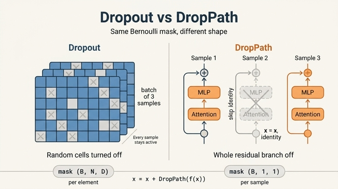

# DropPath와 Dropout의 차이

> **Q.** DropPath와 Dropout의 차이는?
>
> **A.** Dropout은 개별 **원소**를 끄지만 DropPath는 **샘플 하나의 잔차 경로 전체**를 끈다. 마스크가 0인 샘플은 그 블록에서 $x = x$, 즉 항등 함수가 된다.

---

## 1. 한 줄로: 마스크의 shape가 다르다

둘 다 "베르누이 마스크를 곱하고 살아남은 값을 $1/(1-p)$ 로 키운다"는 inverted dropout 골격을 공유한다. 다른 것은 **마스크를 어느 축까지 브로드캐스트하는가**뿐이다.

| | Dropout | DropPath (stochastic depth) |
|---|---|---|
| 입력 텐서 | $(B, N, D)$ | $(B, N, D)$ |
| 마스크 shape | $(B, N, D)$ — 원소마다 독립 | $(B, 1, 1)$ — **샘플마다 하나** |
| 끄는 단위 | 스칼라 활성값 하나 | 그 샘플의 서브레이어 출력 **전체** |
| 배치 안 다른 샘플 | 서로 다른 원소가 꺼짐 | 샘플 단위로 통째로 ON/OFF |
| 걸리는 위치 | `Mlp` 내부, `Attention`의 attn/proj | `Block`의 residual **덧셈 항** |
| $p=0$ 이거나 eval | 항등 | 항등 |

DINO의 `drop_path()` 에서 shape를 만드는 한 줄이 핵심이다.

```python
def drop_path(x, drop_prob: float = 0., training: bool = False):
    if drop_prob == 0. or not training:
        return x
    keep_prob = 1 - drop_prob
    shape = (x.shape[0],) + (1,) * (x.ndim - 1)  # → (B, 1, 1)
    random_tensor = keep_prob + torch.rand(shape, dtype=x.dtype, device=x.device)
    random_tensor.floor_()                       # binarize
    output = x.div(keep_prob) * random_tensor
    return output
```

`shape = (x.shape[0],) + (1,) * (x.ndim - 1)` 가 배치 축만 남기고 나머지를 1로 만든다. 그래서 마스크 원소 수는 $B$ 개뿐이고, 곱셈에서 $(N, D)$ 로 브로드캐스트되어 **한 샘플의 197×384 개 값이 전부 같은 운명**을 맞는다. `nn.Dropout` 은 반대로 $B \times N \times D$ 개의 독립 마스크를 뽑는다.

수식으로:

$$
\text{Dropout:}\quad \tilde{x}_{i,n,d} = \frac{x_{i,n,d}}{1-p}\cdot m_{i,n,d},
\qquad m_{i,n,d}\sim\mathrm{Bernoulli}(1-p)
$$

$$
\text{DropPath:}\quad \tilde{x}_{i,:,:} = \frac{x_{i,:,:}}{1-p}\cdot m_{i},
\qquad m_{i}\sim\mathrm{Bernoulli}(1-p)
$$

두 경우 모두 $\mathbb{E}[\tilde{x}] = x$ 로 기대값이 보존되므로 (`x.div(keep_prob)`), eval에서는 보정 없이 `return x` 만 하면 된다.

## 2. residual 덧셈 항에만 걸리기 때문에 항등이 된다

DropPath가 "경로를 끈다"고 말할 수 있는 이유는 위 함수 자체가 아니라 **어디에 꽂혔는가**에 있다. `Block.forward` 를 보자.

```python
def forward(self, x, return_attention=False):
    y, attn = self.attn(self.norm1(x))
    if return_attention:
        return attn
    x = x + self.drop_path(y)
    x = x + self.drop_path(self.mlp(self.norm2(x)))
    return x
```

$$
\begin{aligned}
x &\leftarrow x + \mathrm{DropPath}\big(\mathrm{MHSA}(\mathrm{LN}(x))\big)\\
x &\leftarrow x + \mathrm{DropPath}\big(\mathrm{Mlp}(\mathrm{LN}(x))\big)
\end{aligned}
$$

DropPath는 `x + ...` 의 **오른쪽 항만** 감싼다. skip connection의 `x` 는 건드리지 않는다. 따라서 샘플 $i$ 의 마스크가 $m_i = 0$ 이면

$$
x_i \leftarrow x_i + 0 = x_i
$$

이 되어 **그 블록이 그 샘플에게는 항등 함수**가 된다. Attention도 MLP도 계산은 되지만 결과가 0으로 곱해져 출력에 전혀 기여하지 않고, gradient도 그 샘플 몫만큼 그 블록의 파라미터에 흐르지 않는다.

Dropout이 같은 자리에 있었다면 이런 일이 일어나지 않는다. $(B,N,D)$ 마스크는 서브레이어 출력의 일부 원소만 0으로 만들 뿐이라, 남은 원소들이 여전히 `x` 에 더해진다. 블록은 여전히 "무언가 하는" 층이고, 항등이 되는 경우는 확률적으로 사실상 없다.

> 참고: `Block.__init__` 은 `self.drop_path = DropPath(drop_path) if drop_path > 0. else nn.Identity()` 로, 확률이 0인 블록에서는 모듈 자체를 `nn.Identity` 로 둔다. 그리고 **같은 모듈 인스턴스**를 attention 항과 MLP 항에 재사용하지만, 호출마다 마스크를 새로 뽑으므로 두 서브레이어는 독립적으로 꺼진다.

## 3. "stochastic depth"라는 이름의 유래

$m_i = 0$ 인 블록이 그 샘플에게 항등이라는 것은, 그 샘플이 보기에 **네트워크에 그 층이 없는 것과 같다**는 뜻이다. depth 12의 ViT에서 어떤 샘플이 3개 블록에서 꺼졌다면 그 샘플은 실질적으로 depth 9 네트워크를 통과한 것이다.

즉 매 스텝, 매 샘플마다 네트워크의 **깊이가 확률적으로 달라진다** — 이것이 stochastic depth (Huang et al., 2016, "Deep Networks with Stochastic Depth")라는 이름의 유래다. 이름이 성립하려면 pre-norm residual 구조가 필수다. post-norm ($x \leftarrow \mathrm{LN}(x + \mathrm{sub}(x))$) 이라면 서브레이어를 껐어도 LayerNorm이 남아 항등이 되지 않는다.

DINO는 깊은 블록일수록 더 많이 끄는 선형 스케줄을 쓴다.

```python
dpr = [x.item() for x in torch.linspace(0, drop_path_rate, depth)]  # stochastic depth decay rule
```

블록 0은 $p=0$ (→ `nn.Identity`), 마지막 블록이 $p = $ `drop_path_rate`. 얕은 층은 뒤쪽 전부의 입력이니 섣불리 끄지 않고, 표현이 중복적인 깊은 층에서 위험을 감수하는 셈이다.

## 4. 정규화 효과의 차이 — 앙상블 관점

두 기법 모두 "학습 때 서브모델을 랜덤 샘플링하고, 추론 때는 전체를 쓰는 암묵적 앙상블"로 해석되지만 **무엇의 앙상블**인지가 다르다.

- **Dropout = 뉴런(피처) 앙상블.** 원소 단위로 꺼서, 특정 뉴런에 의존하는 co-adaptation을 깬다. 한 층 안에서 어떤 유닛이 살아 있을지 모르니 표현이 중복적·분산적이 된다. 학습되는 것은 $2^{\#\text{units}}$ 개의 얇아진(thinned) 네트워크들의 앙상블.
- **DropPath = 깊이 앙상블.** 블록 단위로 꺼서, 깊이가 다른 $2^{L}$ 개 서브네트워크(depth 12, 11, 10, … 를 랜덤하게 오가는)의 앙상블을 학습한다. 특정 블록 하나에 결정적으로 의존할 수 없게 되고, gradient가 짧은 경로로도 흐르므로 깊은 모델의 학습이 안정화·가속된다.

실무적으로도 성격이 다르다. Dropout은 활성값에 원소 단위 노이즈를 넣어 Transformer의 표현(특히 attention 분포)을 흐트러뜨리기 쉬워, ViT 계열에서는 대개 끄고 대신 DropPath를 쓴다. DropPath는 노이즈가 아니라 "층 건너뛰기"라서 표현 자체를 오염시키지 않는다.

## 5. eval에서는 둘 다 항등

- `drop_path()` 첫 줄: `if drop_prob == 0. or not training: return x` — 확률적 스케일링도, 마스크도 없다.
- `nn.Dropout` 역시 `model.eval()` 에서 그대로 통과시킨다.

둘 다 학습 중 $1/(1-p)$ 로 미리 보정(inverted dropout)해 두었기 때문에 추론 시 별도 보정이 없어도 통계가 맞는다. 그래서 `Block` 을 `eval()` 로 두면 다음 두 줄로 forward를 정확히 손계산 재현할 수 있다.

```python
step1 = z + block.attn(block.norm1(z))[0]
step2 = step1 + block.mlp(block.norm2(step1))   # == block(z), DropPath는 항등
```

DINO의 teacher 네트워크가 애초에 `drop_path_rate` 없이 만들어지는 것도 같은 맥락이다 — teacher는 gradient가 없으니 정규화가 필요 없다.

```python
student = vits.__dict__[args.arch](patch_size=args.patch_size,
                                   drop_path_rate=args.drop_path_rate)  # stochastic depth
teacher = vits.__dict__[args.arch](patch_size=args.patch_size)          # 없음
```

## 6. DINO에서의 실제 설정: Dropout은 사실상 안 쓴다

`VisionTransformer.__init__` 시그니처의 기본값은

```python
drop_rate=0., attn_drop_rate=0., drop_path_rate=0.
```

이고, `main_dino.py` 는 `--drop_path_rate` 만 넘긴다.

```python
parser.add_argument('--drop_path_rate', type=float, default=0.1, help="stochastic depth rate")
```

결과적으로 DINO 학습에서는

- `drop_rate = 0` → `pos_drop`, `Mlp.drop`, `Attention.proj_drop` 이 전부 $p=0$ 인 `nn.Dropout` (항등)
- `attn_drop_rate = 0` → `Attention.attn_drop` 도 항등
- `drop_path_rate = 0.1` → 블록 0의 0.0 부터 블록 11의 0.1 까지 선형 증가하는 DropPath만 실제로 작동, 그것도 **student에만**

즉 DINO의 ViT에서 확률적 정규화는 **오직 DropPath 하나**다. Dropout 모듈들은 timm 호환을 위해 자리만 잡고 있는 셈이다.

## 7. 흔한 함정

- **마스크를 $(B,N,D)$ 로 만들면 DropPath가 아니다.** 이름만 DropPath이고 동작은 Dropout이 된다. 구현을 볼 때 `shape` 계산 한 줄을 확인하는 습관이 좋다.
- **residual 밖에 걸면 항등이 안 된다.** `x = self.drop_path(x + y)` 로 잘못 쓰면 마스크 0일 때 $x \leftarrow 0$ 이 되어 그 샘플의 표현이 통째로 사라진다. 반드시 덧셈 항만 감싸야 한다.
- **$p$ 를 크게 잡으면 깊은 모델이 사실상 얕아진다.** ViT-S/B의 통상 범위는 0.05~0.1 (DINO는 0.1), 아주 큰 모델이나 긴 학습에서 0.2~0.4 대를 쓴다.
- **DropPath의 $1/(1-p)$ 보정은 살아남은 샘플의 잔차 항만 키운다.** skip으로 오는 $x$ 는 보정되지 않으므로, 블록 출력의 기대값 차원에서 보존이 성립하는 것이지 개별 forward가 스케일 불변인 것은 아니다.

## 인포그래픽


