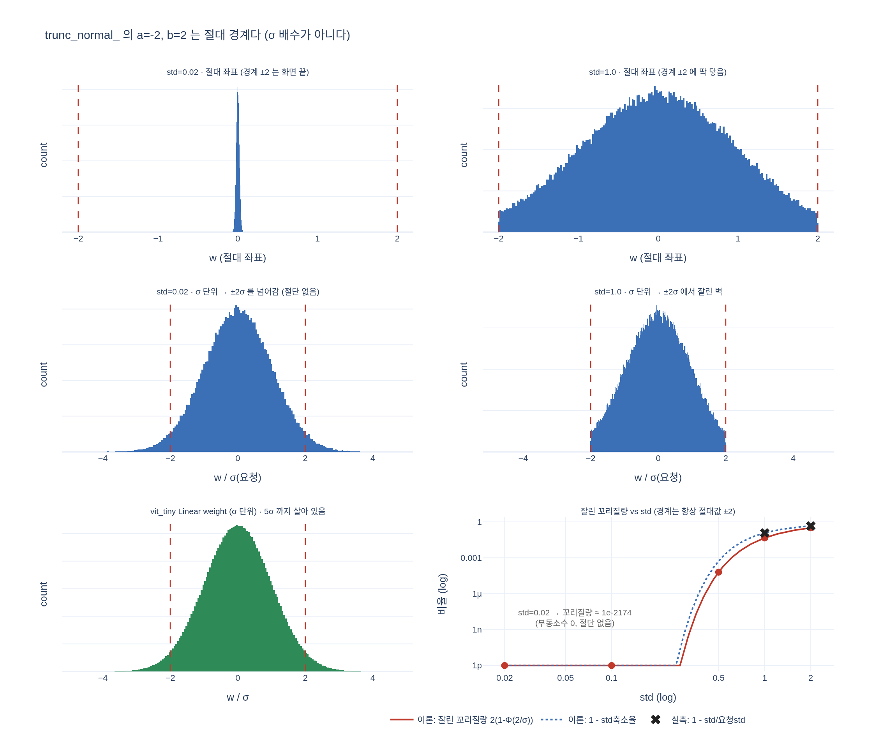

# `trunc_normal_(std=.02)` 에서 절단이 일어나지 않는 이유

`a=-2, b=2` 는 **절대 경계**이지 $\sigma$ 배수가 아니다. `std=.02` 이면 경계가
$\pm100\sigma$ 에 놓여 사실상 잘리지 않는다. 실측 `max|w|` 는 0.0886(4.43σ)로
$2\sigma$ 를 훌쩍 넘는다.

## 시각화

