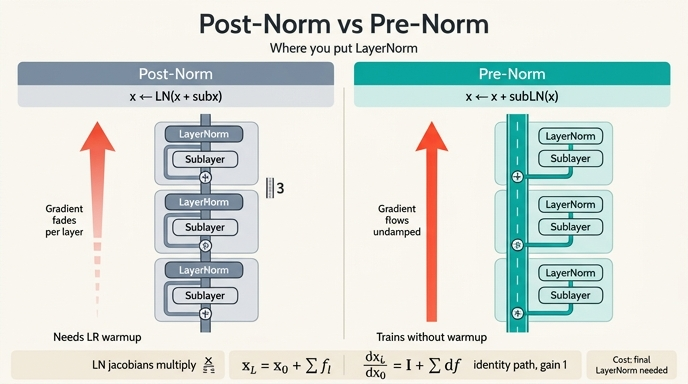

# pre-norm vs post-norm — 항등 경로가 만드는 차이

## 1. 두 구조의 수식

한 블록이 서브레이어 $\mathrm{sub}(\cdot)$ (MHSA 또는 MLP)를 가진다고 할 때,

**post-norm** (원 Transformer, Vaswani et al. 2017):

$$
x \;\leftarrow\; \mathrm{LN}\big(x + \mathrm{sub}(x)\big)
$$

**pre-norm** (GPT-2, ViT, DINO):

$$
x \;\leftarrow\; x + \mathrm{sub}\big(\mathrm{LN}(x)\big)
$$

차이는 **LN의 위치 하나**다. post-norm은 LN이 *덧셈 뒤*, 즉 **메인 경로 위에** 놓인다.
pre-norm은 LN이 *분기 안쪽*, 즉 **서브레이어의 입력에만** 놓이고 메인 경로는 건드리지 않는다.

## 2. DINO 코드에서

`/home/sungwoo/projects/swcho/dino/vision_transformer.py` 의 `Block.forward` (L107–113):

```python
def forward(self, x, return_attention=False):
    y, attn = self.attn(self.norm1(x))
    if return_attention:
        return attn
    x = x + self.drop_path(y)                              # ← 이 두 줄이 pre-norm
    x = x + self.drop_path(self.mlp(self.norm2(x)))        # ← LN 은 괄호 *안쪽*에만
    return x
```

핵심은 두 대입문의 오른쪽이 모두 `x + (뭔가)` 형태이고, 그 `x` 에는 아무 변환도 걸려 있지
않다는 점이다. `self.norm1` / `self.norm2` 는 `attn(...)`, `mlp(...)` 의 인자 안에만 있다.

수식으로:

$$
\begin{aligned}
x &\leftarrow x + \mathrm{DropPath}\big(\mathrm{MHSA}(\mathrm{LN}(x))\big)\\
x &\leftarrow x + \mathrm{DropPath}\big(\mathrm{Mlp}(\mathrm{LN}(x))\big)
\end{aligned}
$$

post-norm이라면 같은 자리가 `x = self.norm1(x + self.drop_path(y))` 가 되어,
`x` 가 LN을 **통과해서** 다음 블록으로 넘어간다.

asset의 재현 실험(`vision_transformer_walkthrough.py` §8)도 이 두 줄을 손으로 풀어
`step1 = z + attn(norm1(z))`, `step2 = step1 + mlp(norm2(step1))` 로 계산하면
`block(z)` 와 일치함을 확인한다 — 잔차 경로에 LN이 없다는 사실의 실측 확인이다.

## 3. 항등 경로(identity path) 유도

pre-norm 블록을 $x_l = x_{l-1} + f_l(x_{l-1})$ 로 쓰자
(여기서 $f_l(\cdot) = \mathrm{sub}_l(\mathrm{LN}_l(\cdot))$). 재귀를 펼치면

$$
\begin{aligned}
x_1 &= x_0 + f_1(x_0)\\
x_2 &= x_1 + f_2(x_1) = x_0 + f_1(x_0) + f_2(x_1)\\
&\;\;\vdots\\
x_L &= x_0 + \sum_{l=1}^{L} f_l(x_{l-1})
\end{aligned}
$$

즉 **입력 $x_0$ 가 어떤 변환도 거치지 않고 그대로 최종 출력에 더해져 있다**.
이것이 "순수 덧셈 고속도로", ResNet의 항등 경로와 같은 구조다.

### gradient 관점

위 식을 $x_0$ 로 미분하면 (야코비안, $I$ 는 항등행렬)

$$
\frac{\partial x_L}{\partial x_0} = I + \sum_{l=1}^{L} \frac{\partial f_l(x_{l-1})}{\partial x_0}
$$

핵심은 **$I$ 항**이다. 손실 $\mathcal{L}$ 에 대해

$$
\frac{\partial \mathcal{L}}{\partial x_0}
= \frac{\partial \mathcal{L}}{\partial x_L}\Big(I + \sum_l \frac{\partial f_l}{\partial x_0}\Big)
= \underbrace{\frac{\partial \mathcal{L}}{\partial x_L}}_{\text{감쇠 없는 직행 성분}}
+ \;\sum_l \frac{\partial \mathcal{L}}{\partial x_L}\frac{\partial f_l}{\partial x_0}
$$

곱셈이 아니라 **덧셈**으로 분해된다. 서브레이어들의 야코비안이 모두 0에 가깝게 죽어도
상위 gradient $\partial\mathcal{L}/\partial x_L$ 이 배율 1로 그대로 도달한다. 깊이 $L$ 이
커져도 이 직행 성분은 줄지 않으므로, 깊은 모델도 첫 스텝부터 학습 신호를 받는다.

### post-norm에서는 곱이 된다

post-norm은 $x_l = \mathrm{LN}\big(x_{l-1} + \mathrm{sub}_l(x_{l-1})\big)$ 이므로
체인룰이 층마다 LN의 야코비안 $J^{\mathrm{LN}}_l$ 을 **곱한다**:

$$
\frac{\partial x_L}{\partial x_0} = \prod_{l=1}^{L} J^{\mathrm{LN}}_l \big(I + J^{\mathrm{sub}}_l\big)
$$

$L$ 개의 행렬 곱이므로 각 인자의 특이값이 평균적으로 1보다 작으면 지수적으로 **감쇠**,
크면 **폭주**한다. 항등항 $I$ 가 곱 바깥으로 빠져나오지 못해 "최소 1 보장"이 사라진다.

특히 LN의 야코비안은 $J^{\mathrm{LN}} \approx \frac{\gamma}{\sigma}\big(I - \frac{1}{d}\mathbf{1}\mathbf{1}^\top - \hat{x}\hat{x}^\top\big)$
형태로, 스케일 인자 $1/\sigma$ 를 포함한다. 잔차 덧셈으로 $\sigma$ 가 커진 상태를 LN이
매번 되돌리기 때문에 backward에서는 그만큼 gradient가 축소되고, 그 축소가 층 수만큼
누적된다.

## 4. warmup 민감도 — Xiong et al. 2020

원 Transformer(post-LN)는 학습률 **warmup 없이는 발산**하는 것으로 유명했다.
Xiong et al., *"On Layer Normalization in the Transformer Architecture"* (ICML 2020)이
그 이유를 이론적으로 분석했다:

- **Post-LN**: 초기화 시점에서 **출력층 근처 파라미터의 gradient 기대 노름이 $\sqrt{\ln d}$ 급으로 크고, 깊이에 따라 더 나빠진다.** 큰 학습률로 첫 스텝을 밟으면 곧바로 해가 망가진다 → 아주 작은 학습률에서 서서히 올리는 warmup이 **필수**. warmup 길이·피크 학습률이 민감한 하이퍼파라미터가 된다.
- **Pre-LN**: 위의 항등 경로 때문에 gradient 노름이 **깊이에 대해 $O(1/\sqrt{L})$ 로 잘 제어**되고 층 간에 균일하다. 그래서 **warmup 단계를 없애도** 학습이 되며, Adam/SGD 모두에서 하이퍼파라미터에 훨씬 둔감하고 수렴도 빠르다.

요약: post-norm의 warmup은 "초기 gradient 폭주를 피하려는 응급처치"였고,
pre-norm은 구조적으로 그 문제를 없앤다. ViT/DINO 계열이 pre-norm을 쓰는 이유도 같다
(실전에서는 안정성을 더 얻으려 여전히 warmup을 쓰지만, **필수는 아니다**).

## 5. pre-norm의 대가

메인 경로에 정규화가 전혀 없으니, $x_L = x_0 + \sum_l f_l$ 의 분산이 층을 지날수록
누적되어 **출력 스케일이 커지고 마지막 블록 출력은 정규화되지 않은 상태**로 나온다.
그래서 `VisionTransformer` 는 블록을 모두 지난 뒤 **마지막에 한 번 더** `self.norm`
(`LayerNorm(eps=1e-6)`)을 적용한다. `get_intermediate_layers` 도 각 중간 출력에
같은 `self.norm` 을 적용한다.

> 이 "마지막 `self.norm` 이 왜 필요한가"는 별도 카드로 다루므로 여기서는 링크만.

부작용이 하나 더 있다: 깊은 층의 $f_l$ 기여가 이미 큰 $x$ 에 상대적으로 묻혀
**깊이 대비 표현력 증가가 둔해지는(representation collapse) 경향**이 보고된다.

## 6. 후속 흐름 한 줄

post-LN을 버리지 않고 되살리려는 흐름도 있다 — **DeepNet**(Wang et al. 2022)은
잔차를 $x \leftarrow \mathrm{LN}(\alpha x + \mathrm{sub}(x))$ 로 스케일링하는 **DeepNorm**
+ 전용 초기화로 post-LN 트랜스포머를 1,000층까지 안정 학습시켰고, sandwich norm
(분기 앞뒤 모두 LN), Gemma 2 / OLMo 2 처럼 pre/post 를 함께 쓰는 하이브리드도 등장했다.

## 7. 한 줄 정리

| | post-norm | pre-norm |
|---|---|---|
| 수식 | $x \leftarrow \mathrm{LN}(x + \mathrm{sub}(x))$ | $x \leftarrow x + \mathrm{sub}(\mathrm{LN}(x))$ |
| LN 위치 | 메인 경로 위 | 분기 안쪽(서브레이어 입력) |
| 전체 전개 | LN이 층마다 끼어듦 | $x_L = x_0 + \sum_l f_l(x_{l-1})$ |
| 야코비안 | $\prod_l J^{\mathrm{LN}}_l(\cdots)$ — 곱 → 감쇠/폭주 | $I + \sum_l \partial f_l$ — 합 → 배율 1 보장 |
| warmup | 사실상 필수 | 없어도 학습됨 |
| 대가 | — | 출력 스케일 누적 → 마지막 `self.norm` 필요 |

## 인포그래픽


