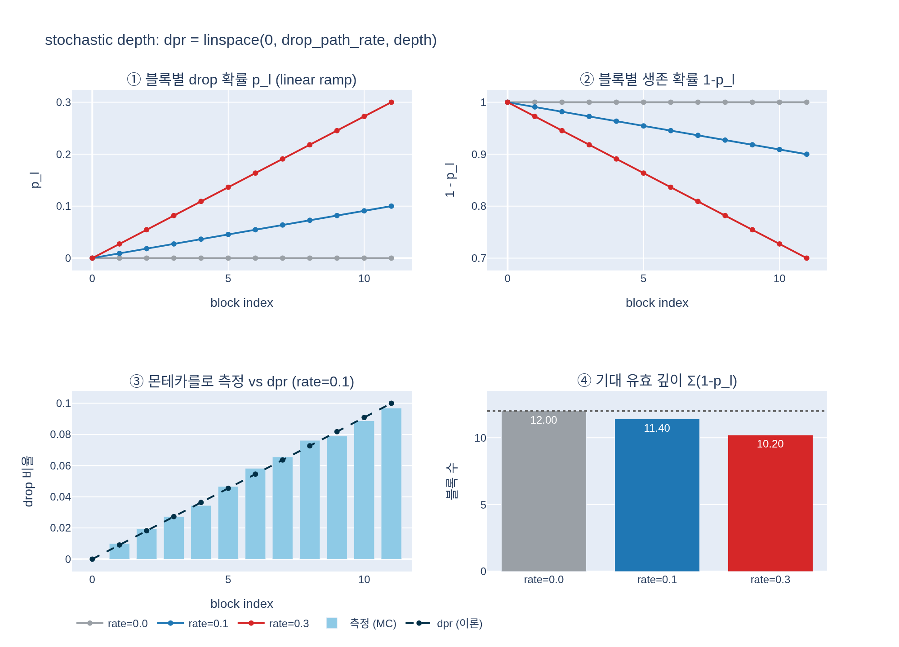

# stochastic depth는 블록 깊이에 따라 어떻게 적용되는가?

`dpr = [x.item() for x in torch.linspace(0, drop_path_rate, depth)]` 로 얕은 블록은 거의 끄지 않고 깊을수록 많이 끈다. `drop_path_rate=0.1`, depth 12면 0.000 → 0.100 으로 선형 증가한다.

## 시각화

