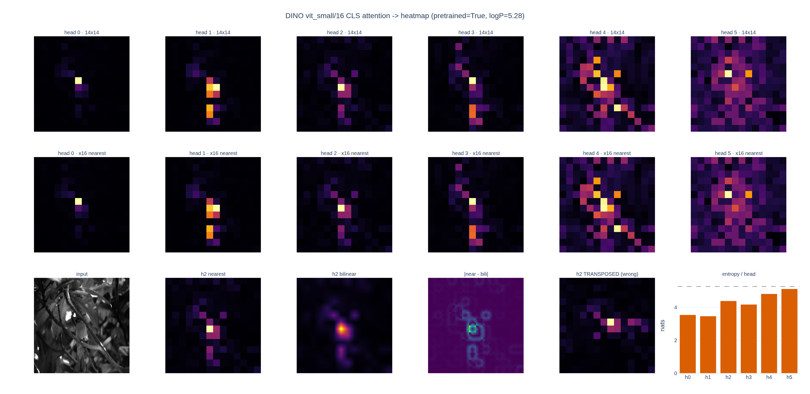

# CLS 어텐션 히트맵은 어떻게 만드는가?

## 한 줄 답

$a^{(h)} = A^{(h)}[0, 1{:}] \in \mathbb{R}^{P}$ 를 $\sqrt{P}\times\sqrt{P}$ 로 reshape한 뒤
patch_size 배로 업샘플한다. 224px/patch16이면 $14\times14 \to 224\times224$.

DINO 저장소에서 이 일을 하는 코드는 [`visualize_attention.py`](../../../../visualize_attention.py) 의
딱 여섯 줄이다. 아래에서 그 여섯 줄을 순서대로 짚는다.

---

## 0. 왜 이게 성립하는가

마지막 블록의 self-attention 행렬은 head $h$ 마다

$$
A^{(h)} = \operatorname{softmax}\!\left(\frac{Q^{(h)} K^{(h)\top}}{\sqrt{d_h}}\right) \in \mathbb{R}^{N \times N},
\qquad N = P + 1
$$

이고, 토큰 순서는 `prepare_tokens` 에서 정한 대로 **`[CLS, patch_1, ..., patch_P]`** 다.
따라서 $A^{(h)}$ 의 **0번 행**은 "CLS 쿼리가 각 토큰을 얼마나 보는가"이고,
그 행에서 0번 열(CLS→CLS)을 떼면 패치마다 스칼라 하나가 남는다:

$$
a^{(h)}_i = A^{(h)}[0,\, i+1], \qquad i = 0, \dots, P-1
$$

패치 $i$ 는 이미지 위의 $p \times p$ 정사각형에 1:1 대응하니, 이 벡터를 격자로 접고
$p$ 배로 늘리면 곧 이미지 크기의 히트맵이 된다. **여기서 하는 일은 시각화용 좌표 변환뿐이고,
새로 계산되는 값은 하나도 없다.**

---

## 1. 어텐션 행렬 뽑기 — `get_last_selfattention`

```python
attentions = model.get_last_selfattention(img.to(device))
```

[`vision_transformer.py`](../../../../vision_transformer.py) 쪽 구현은 이렇다.

```python
def get_last_selfattention(self, x):
    x = self.prepare_tokens(x)
    for i, blk in enumerate(self.blocks):
        if i < len(self.blocks) - 1:
            x = blk(x)
        else:
            # return attention of the last block
            return blk(x, return_attention=True)
```

- 마지막 블록만 `return_attention=True` 로 부른다 → `Block.forward` 가 `attn` 을 그대로 반환.
  즉 **마지막 블록의 출력 토큰은 계산되지 않는다** (어텐션까지만).
- 반환 shape은 $(B, \text{heads}, N, N)$. ViT-S/16 · 224px 이면 $(1, 6, 197, 197)$.
- DINO의 `Attention.forward` 가 `return x, attn` 으로 **항상 어텐션 맵을 함께 돌려주도록**
  고쳐져 있어서 이게 가능하다 (timm 원본은 `attn` 을 버린다).

---

## 2. 격자 크기 계산 — `w_featmap` / `h_featmap` 을 따로

```python
# make the image divisible by the patch size
w, h = img.shape[1] - img.shape[1] % args.patch_size, img.shape[2] - img.shape[2] % args.patch_size
img = img[:, :w, :h].unsqueeze(0)

w_featmap = img.shape[-2] // args.patch_size
h_featmap = img.shape[-1] // args.patch_size
```

두 가지가 여기서 결정된다.

1. **패치로 나누어떨어지게 잘라낸다.** `PatchEmbed` 의 `Conv2d(stride=p)` 는 나머지 픽셀을
   조용히 버리므로, 자르지 않으면 $P$ 와 `w_featmap * h_featmap` 이 어긋나 `reshape` 이 터진다.
2. **두 축을 각각 계산한다.** `--image_size 480 480` 처럼 정사각이면 둘이 같지만,
   `--image_size 96 224` 같은 직사각 입력이면 $6 \times 14$ 격자가 된다.
   $\sqrt{P}$ 로 뭉개면 안 되는 이유다 — 카드의 $\sqrt{P}\times\sqrt{P}$ 는 정사각 입력에서의 특수한 경우다.

$$
P = W_{\text{feat}} \cdot H_{\text{feat}} = \left\lfloor \frac{W}{p} \right\rfloor \cdot \left\lfloor \frac{H}{p} \right\rfloor
$$

---

## 3. CLS 행 슬라이싱 — `attentions[0, :, 0, 1:]`

```python
nh = attentions.shape[1]  # number of head

# we keep only the output patch attention
attentions = attentions[0, :, 0, 1:].reshape(nh, -1)
```

네 개의 인덱스를 하나씩 보면

| 축 | 값 | 의미 |
|---|---|---|
| batch | `0` | 첫 장만 |
| head | `:` | **모든 head 유지** (평균하지 않는다) |
| query | `0` | 쿼리 = CLS 토큰 |
| key | `1:` | CLS→CLS 를 버리고 패치만 |

결과는 $(6, 196)$. 주의할 점:

- **행 방향이 쿼리다.** `[..., 0, 1:]` 이 아니라 `[..., 1:, 0]` 을 쓰면 "각 패치가 CLS를 보는 정도"가
  되어 완전히 다른 양이 된다. 이건 softmax가 걸린 축도 아니라서 정규화되어 있지도 않다.
- **`1:` 때문에 합이 1보다 작아진다.** $\sum_j A^{(h)}[0,j] = 1$ 이지만 CLS→CLS 몫을 빼기 때문이다.
  실측(ViT-S/16 사전학습, 샘플 이미지)에서 head별 잔여 질량은 0.84~0.94, CLS→CLS 값은 0.06~0.16 이었다.
  그래서 히트맵을 확률로 읽으려면 다시 정규화해야 한다.

---

## 4. 격자로 접기 — `reshape(nh, w_featmap, h_featmap)`

```python
attentions = attentions.reshape(nh, w_featmap, h_featmap)
```

`PatchEmbed` 가 패치를 **row-major(C order)** 로 펼쳤으므로 인덱스 대응은

$$
i = r \cdot W_{\text{feat}} + c
\quad\Longleftrightarrow\quad
r = \left\lfloor \frac{i}{W_{\text{feat}}} \right\rfloor,\;\;
c = i \bmod W_{\text{feat}}
$$

여기서 축 순서를 바꿔 `reshape(hf, wf)` 를 쓰거나 뒤에 `.T` 를 붙이면 히트맵이
**주대각선 기준으로 뒤집힌다**. 최대 집중 패치 좌표가 $(r,c) \to (c,r)$ 로 맞바뀐다.

**정사각 격자에서는 예외가 나지 않으므로 조용히 틀린다.** 게다가 최대값이 우연히
대각선 위($r = c$)에 있으면 좌표조차 그대로여서 놓치기 쉽다. 실측 예:

| head | 올바른 argmax | 전치했을 때 | 발각 여부 |
|---|---|---|---|
| 0 | (6,6) | (6,6) | 좌표로는 못 잡음 |
| 2 | (7,6) | (6,7) | 바뀜 |
| 4 | (7,6) | (6,7) | 바뀜 |

직사각 입력에서는 같은 실수가 `RuntimeError: shape '[28, 8]' is invalid for input of size 196`
처럼 바로 터진다. 그래서 **비정사각 입력으로 한 번 돌려보는 것이 가장 값싼 방향 검증**이다.

---

## 5. patch_size 배 업샘플 — 왜 `nearest` 인가

```python
attentions = nn.functional.interpolate(
    attentions.unsqueeze(0), scale_factor=args.patch_size, mode="nearest"
)[0].cpu().numpy()
```

- `interpolate` 는 $(N, C, H, W)$ 를 받으므로 `unsqueeze(0)` 로 head 축을 채널 자리에 넣고,
  결과에서 `[0]` 으로 되돌린다. $(6,14,14) \to (1,6,14,14) \to (1,6,224,224) \to (6,224,224)$.
- `scale_factor=patch_size` 이므로 출력 크기는 잘라낸 입력 이미지와 정확히 같다.
  두 축 비율이 달라도(직사각 격자) scale_factor 하나로 맞는다 — 격자와 이미지의 비율이 애초에 같으니까.

### `nearest` 의 이유: 어텐션은 패치보다 잘게 정의되지 않았다

$a^{(h)}_i$ 는 "패치 $i$ 전체에 대한 하나의 값"이다. 패치 **내부**의 분포에 대한 정보는
모델이 만들지도 않았고 데이터에도 없다. `nearest` 는 $p \times p$ 블록을 상수로 채워
이 사실을 그대로 보존한다. 격자 무늬가 보이는 건 결함이 아니라 **어텐션의 실제 해상도**다.

`bilinear` 는 인접 패치 값을 섞어 **없는 중간값을 만들어 낸다.** 같은 데이터로 측정하면:

| 지표 | `nearest` | `bilinear` |
|---|---|---|
| head0 고유값 개수 | 196 (= 패치 수) | 44,064 |
| 전체 최대값 | 0.280626 | 0.265645 (**5.3% 깎임**) |
| $p\times p$ 블록 내부 std 평균 | 0.0 | $1.3\times10^{-3}$ |
| 두 결과의 최대 절대차 | — | 0.198546 (원본 최대값의 70.8%) |

- **고유값 196 → 44,064**: 늘어난 값은 전부 보간이 발명한 것이다.
- **최대값이 깎인다**: bilinear는 피크를 이웃과 평균하므로 "가장 강하게 보는 패치"의 값이
  원본과 달라진다. 임계값 기준으로 마스크를 뽑거나 head 간 세기를 비교할 때 이게 편향을 만든다.
- **경계가 흐려진다**: 세그멘테이션 마스크처럼 쓸 때 실제로는 패치 단위로만 존재하는 경계가
  픽셀 단위로 부드러워져, 있지도 않은 정밀도를 주장하게 된다.

논문 그림처럼 부드럽게 보이고 싶다면, 업샘플 모드를 바꾸는 대신 **`--patch_size 8` 과
큰 `--image_size` 를 쓰는 것이 정직한 방법**이다. 격자 자체가 촘촘해진다.

```bash
python visualize_attention.py --arch vit_small --patch_size 8 \
    --image_size 480 480 --threshold 0.6 --output_dir out/dino_attn
```

---

## 6. head마다 따로 그리는 이유

```python
for j in range(nh):
    fname = os.path.join(args.output_dir, "attn-head" + str(j) + ".png")
    plt.imsave(fname=fname, arr=attentions[j], format='png')
```

`nh` 개(ViT-S는 6개) 파일이 따로 저장된다. 평균 한 장으로 합치지 않는 이유는 세 가지다.

1. **head 마다 보는 대상이 다르다.** DINO 논문의 "emerging properties" 가 정확히 이 관찰이다 —
   레이블 없이 학습했는데 어떤 head는 객체 전체, 어떤 head는 특정 부위를 잡는다.
   평균하면 이 분업이 서로 지워진다.
2. **집중도(엔트로피)가 head 마다 다르다.** 실측 (ViT-S/16, 사전학습):

   $$
   H(a^{(h)}) = -\sum_{i=1}^{P} \hat a^{(h)}_i \log \hat a^{(h)}_i,
   \qquad \hat a^{(h)} = \frac{a^{(h)}}{\sum_i a^{(h)}_i}
   $$

   | head | $H$ [nats] | $H / \log P$ | 유효 패치 수 $e^H$ |
   |---|---|---|---|
   | 0 | 3.552 | 0.673 | 34.9 |
   | 1 | 3.476 | 0.659 | 32.3 |
   | 2 | 4.400 | 0.834 | 81.5 |
   | 3 | 4.187 | 0.793 | 65.8 |
   | 4 | 4.831 | 0.915 | 125.3 |
   | 5 | 5.131 | 0.972 | 169.2 |

   상한은 $\log P = \log 196 \approx 5.278$ (완전 균등). head0은 사실상 35개 패치만 보고,
   head5는 170개를 훑는다. 평균 한 장은 결국 넓게 퍼진 head가 지배해 흐릿해진다.
3. **스케일이 달라 정규화가 공유되지 않는다.** 최대값이 head0은 0.28, head5는 0.02 다.
   한 컬러바에 묶으면 낮은 head는 전부 검게 죽는다.

랜덤 초기화 모델을 같은 방식으로 그려 보면 모든 head의 $H$ 가 $\log P$ 에 붙는다 —
그게 "학습으로 생긴 구조" 와 "코드가 항상 그리는 그림" 을 구별하는 기준선이다.

---

## 7. `--threshold`: 누적 질량 마스크

```python
if args.threshold is not None:
    # we keep only a certain percentage of the mass
    val, idx = torch.sort(attentions)
    val /= torch.sum(val, dim=1, keepdim=True)
    cumval = torch.cumsum(val, dim=1)
    th_attn = cumval > (1 - args.threshold)
    idx2 = torch.argsort(idx)
    for head in range(nh):
        th_attn[head] = th_attn[head][idx2[head]]
    th_attn = th_attn.reshape(nh, w_featmap, h_featmap).float()
    th_attn = nn.functional.interpolate(
        th_attn.unsqueeze(0), scale_factor=args.patch_size, mode="nearest"
    )[0].cpu().numpy()
```

**"어텐션 질량의 상위 `threshold` 를 담는 최소 패치 집합"** 을 이진 마스크로 만든다.
`--threshold 0.6` = 질량 60%. 단계별로:

1. `torch.sort(attentions)` — 오름차순 정렬. `val` 은 정렬된 값, `idx` 는 원래 위치.
2. `val /= sum` — 합 1로 정규화 (`1:` 슬라이싱으로 합이 1이 아니게 됐으니 다시 맞춘다).
3. `cumsum` — 작은 것부터 누적.
4. `cumval > (1 - threshold)` — 누적이 40%를 넘는 지점부터 `True`. 즉 **위쪽 60% 질량**.
5. `idx2 = torch.argsort(idx)` — 정렬 순열의 역순열. `th_attn[head][idx2[head]]` 로
   마스크를 **원래 패치 순서로 되돌린다**. 이 한 줄을 빼면 마스크가 완전히 뒤죽박죽이 된다.
6. 격자로 reshape → 같은 `nearest` 로 업샘플. 값은 0/1 만 남는다 —
   그래서 `nearest` 가 필수다. bilinear면 경계에 0.37 같은 값이 생겨 이진 마스크가 아니게 된다.

여기서 중요한 성질: **`threshold` 는 면적이 아니라 질량 기준**이라서 남는 패치 수가 head마다 크게 다르다.

| head | 남은 패치 / 196 | 면적 비율 | 담은 질량 |
|---|---|---|---|
| 0 | 9 | 4.6% | 0.600 |
| 1 | 7 | 3.6% | 0.624 |
| 2 | 26 | 13.3% | 0.602 |
| 3 | 18 | 9.2% | 0.612 |
| 4 | 45 | 23.0% | 0.605 |
| 5 | 75 | 38.3% | 0.601 |

집중된 head0은 9개 패치로 60%를 채우고, 퍼진 head5는 75개가 필요하다.
즉 **면적이 곧 "객체 크기"가 아니다** — head의 집중도를 같이 봐야 한다.
질량이 정확히 0.600이 아닌 것은 패치 단위 이산성 때문이다 (경계 패치 하나를 넣거나 빼야 하므로).

마스크는 `display_instances` 로 원본 위에 색을 얹고 `find_contours` 로 외곽선을 그려
`mask_th0.6_head0.png` 형태로 저장된다.

---

## 8. 정규화와 컬러맵 주의점

```python
plt.imsave(fname=fname, arr=attentions[j], format='png')
```

`plt.imsave` 는 **배열 min/max 로 알아서 스트레치**한다. 여기서 오는 함정들.

- **head 간 비교가 불가능하다.** 각 파일이 자기 min/max 로 정규화되므로,
  거의 균등한 head도 "뭔가 잡은 것처럼" 대비가 살아난다. **랜덤 초기화 모델의 어텐션도
  그럴듯한 무늬로 보인다** — 이게 가장 위험한 오독이다. head를 비교하려면
  `vmin=0, vmax=attentions.max()` 를 공유하거나 값 자체를 병기해야 한다.
- **`0` 이 어디인지 표시되지 않는다.** 어텐션은 $[0,1]$ 의 양수이고 최소값도 0이 아니다
  (실측 최소 $1.5\times10^{-4}$). 자동 스트레치는 이 하한을 검정으로 밀어 "안 본다"처럼 보이게 한다.
- **컬러맵**: 어텐션은 **일방향(sequential)** 양이므로 `inferno` / `viridis` / `magma` 같은
  perceptually uniform sequential 맵을 써야 한다. `jet` 은 밝기가 단조롭지 않아 없는 경계선을
  만들어 낸다. `coolwarm` 같은 diverging 맵은 중앙 기준값이 의미 있을 때 쓰는 것이라 부적절하다.
  `plt.imsave` 는 기본 `viridis` 를 쓰므로 그대로 두면 무난하다.
- **로그 스케일이 필요한 경우**: 집중된 head는 상위 몇 개 패치가 나머지를 압도해
  선형 스케일에서 배경이 전부 검게 죽는다. 약한 구조를 보고 싶으면 $\log a$ 나
  퍼센타일 클리핑(예: 99th percentile 을 `vmax`)을 쓴다. 단, 그 그림은 더 이상
  "질량의 비율"을 보여주지 않는다는 걸 캡션에 밝혀야 한다.
- **CLS→CLS 를 뺀 뒤라 합이 1이 아니다** (0.84~0.94). 히트맵을 확률 분포로 읽거나
  head 간 질량을 비교하려면 $\hat a^{(h)} = a^{(h)} / \sum_i a^{(h)}_i$ 로 다시 정규화한다.

---

## 요약 표

| 단계 | 코드 | shape (ViT-S/16, 224px) |
|---|---|---|
| 어텐션 뽑기 | `model.get_last_selfattention(img)` | $(1, 6, 197, 197)$ |
| 격자 크기 | `w_featmap = W // p`, `h_featmap = H // p` | $14, 14$ |
| CLS 행 · CLS열 제거 | `attentions[0, :, 0, 1:].reshape(nh, -1)` | $(6, 196)$ |
| 격자로 접기 | `.reshape(nh, w_featmap, h_featmap)` | $(6, 14, 14)$ |
| 픽셀 크기로 확대 | `interpolate(.unsqueeze(0), scale_factor=p, mode="nearest")[0]` | $(6, 224, 224)$ |
| head별 저장 | `plt.imsave(f"attn-head{j}.png", attentions[j])` | 6개 파일 |

체크리스트

- [ ] 이미지를 patch_size 배수로 잘랐는가
- [ ] `w_featmap` / `h_featmap` 을 각 축 따로 계산했는가
- [ ] 슬라이스가 `[0, :, 0, 1:]` 인가 (query 축이 앞)
- [ ] `reshape` 축 순서가 row-major 기준 `(w_featmap, h_featmap)` 인가 — 직사각 입력으로 검증
- [ ] 업샘플 모드가 `nearest` 인가
- [ ] head를 평균하지 않았는가
- [ ] head 간 비교 시 컬러 스케일을 공유했는가

---

## 시각화



1행은 head별 원본 $14\times14$, 2행은 같은 head를 $\times16$ `nearest` 업샘플한 $224\times224$ —
**두 행이 픽셀 배치까지 동일하다**는 것이 `nearest` 가 값을 하나도 바꾸지 않는다는 증거다.
3행은 입력 / head2 nearest / head2 bilinear / 둘의 절대차 / head2 를 전치한 반례 / head별 엔트로피
(점선은 $\log P$). bilinear 패널이 부드럽게 보이는 만큼이 만들어진 정보이고,
절대차 패널이 패치 경계마다 링을 그리는 것이 그 증거다. 전치 패널은 같은 데이터인데도
집중 영역이 대각선 기준으로 뒤집혀 있다.
