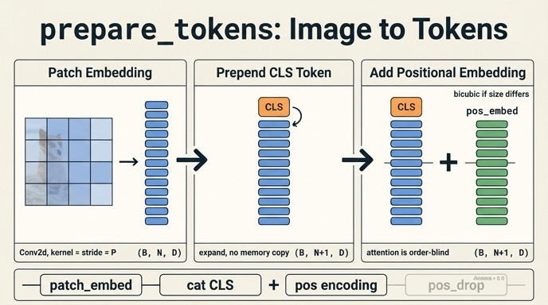

# `prepare_tokens`가 하는 세 가지 일

**Q.** `prepare_tokens`가 하는 세 가지 일은?

**A.** ① `patch_embed`로 패치 토큰 만들기, ② `cls_token.expand`로 CLS를 앞에 concat, ③ `interpolate_pos_encoding` 결과를 더해 위치 정보를 주입하는 것.

`prepare_tokens`는 **이미지 텐서 → Transformer 블록이 먹을 수 있는 토큰 시퀀스**로 바꿔주는 어댑터다.
`forward`는 이 함수 하나에 전처리 전부를 맡기고, 나머지는 블록 반복 + LayerNorm + `x[:, 0]`뿐이다.

---

## 전체 코드 (DINO `vision_transformer.py`)

```python
def prepare_tokens(self, x):
    B, nc, w, h = x.shape
    x = self.patch_embed(x)                          # ① (B, N, D)

    # add the [CLS] token to the embed patch tokens
    cls_tokens = self.cls_token.expand(B, -1, -1)    # ② (B, 1, D)
    x = torch.cat((cls_tokens, x), dim=1)            # ② (B, N+1, D)

    # add positional encoding to each token
    x = x + self.interpolate_pos_encoding(x, w, h)   # ③ (B, N+1, D)

    return self.pos_drop(x)                          # ④ dropout (기본 0.0)
```

정확히 말하면 "세 가지 일 + `pos_drop`"이다. 답에서 세 가지로 세는 이유는 `pos_drop`이
`drop_rate=0.0`(DINO 기본값)일 때 사실상 항등 함수라서 개념적으로는 무시되기 때문이다.
하지만 `return` 문의 주인은 `pos_drop`이라는 점은 기억해 두는 게 좋다.

---

## ① `patch_embed`: 이미지를 패치 토큰으로

```python
x = self.patch_embed(x)      # (B, 3, 224, 224) → (B, 196, 192)
```

`PatchEmbed`의 본체는 **Conv2d 하나**다.

```python
self.proj = nn.Conv2d(in_chans, embed_dim, kernel_size=patch_size, stride=patch_size)
x = self.proj(x).flatten(2).transpose(1, 2)
```

`kernel_size = stride = P`이므로 커널이 패치 경계에서 겹치지 않고 딱 맞아떨어진다.
즉 각 출력 위치가 **겹치지 않는 패치 하나의 선형 투영**이고, 논문의 서술과 정확히 같다.

$$
z_p = W_e\,\mathrm{vec}(x_p) + b_e,
\qquad x_p \in \mathbb{R}^{P\times P\times C},\quad W_e \in \mathbb{R}^{D\times P^2C}
$$

shape 변화 (ViT-Tiny/16, 224px):

$$
(B, 3, 224, 224)
\xrightarrow{\ \text{Conv}\ } (B, D, 14, 14)
\xrightarrow{\ \text{flatten(2)}\ } (B, D, 196)
\xrightarrow{\ \text{transpose(1,2)}\ } (B, 196, D)
$$

포인트: `patch_size`를 16 → 8로 바꿔도 Conv 커널 파라미터 수는 거의 같은데
토큰은 $196 \to 784$ (4배), 어텐션 행렬 원소는 **16배**가 된다.

---

## ② `cls_token.expand` + `torch.cat`: CLS를 맨 앞에

```python
cls_tokens = self.cls_token.expand(B, -1, -1)    # (1,1,D) → (B,1,D)
x = torch.cat((cls_tokens, x), dim=1)            # (B,N,D) → (B,N+1,D)
```

- `self.cls_token = nn.Parameter(torch.zeros(1, 1, embed_dim))` — 배치와 무관하게
  **학습되는 벡터 딱 하나**다. `trunc_normal_(self.cls_token, std=.02)`로 초기화되므로
  실제로는 0이 아니다.
- 이미지에서 오는 정보가 전혀 없는 "빈 슬롯"이고, 어텐션을 통해 패치들로부터 정보를
  긁어모으는 역할만 한다. 백본의 최종 출력은 `x[:, 0]` — 이 토큰의 마지막 상태다.
- **`expand`는 메모리를 복사하지 않는다.** 0번 축 stride가 0인 브로드캐스트 뷰만 만든다
  (`repeat`은 실제로 $B$개를 복사한다). 바로 뒤 `torch.cat`이 새 텐서를 만들므로
  복사는 거기서 한 번만 일어난다.
- `dim=1`(토큰 축) 앞에 붙이므로 인덱스 0이 항상 CLS다. 이 규약 때문에
  `interpolate_pos_encoding`도 `pos_embed[:, 0]`을 CLS 몫으로 따로 취급한다.

---

## ③ `interpolate_pos_encoding`: 위치 정보 주입

```python
x = x + self.interpolate_pos_encoding(x, w, h)   # (B,N+1,D) + (1,N+1,D) → (B,N+1,D)
```

$$
z_i \leftarrow z_i + p_i,
\qquad p \in \mathbb{R}^{(N+1)\times D}\ \ \text{(학습 파라미터)}
$$

브로드캐스트 덧셈이므로 배치 전체가 같은 위치 임베딩을 공유한다.

### 왜 필요한가 — 어텐션은 순열 등변이다

$$
\mathrm{Attn}(\Pi Z) = \Pi\,\mathrm{Attn}(Z)\qquad \text{for any permutation } \Pi
$$

토큰이 서로 정보를 주고받는 곳은 `Attention` 하나뿐이고, 그 연산은 순서를 모른다.
`Mlp`·`LayerNorm`·`PatchEmbed`는 전부 토큰별로 똑같이 적용된다.
따라서 위치 임베딩 없이는 **패치를 뒤섞은 이미지와 원본이 완전히 같은 CLS 출력**을 낸다.
walkthrough의 실험이 정확히 이걸 확인한다.

```
pos_embed 없이 패치를 섞었을 때 CLS 출력 차이 : ~0      ← 구분 못 함
pos_embed 를 더한 뒤 섞었을 때 CLS 출력 차이  : 유의미  ← 구분함
```

### 왜 그냥 `+ self.pos_embed`가 아니라 보간인가

`pos_embed`는 224px($14\times14$ 격자)에 맞춰 shape $(1, N{+}1, D)$로 학습된다.
그런데 DINO는 96px local crop, 480px 시각화도 **같은 백본**에 넣는다.
격자 크기가 다르면 shape이 안 맞으니 **bicubic 보간**으로 늘려/줄여 쓴다.

$$
\underbrace{p_{1:N}}_{14\times14\times D}
\ \xrightarrow{\ \text{bicubic}\ }\
\underbrace{p'_{1:N'}}_{h_0\times w_0\times D},
\qquad w_0 = \frac{W}{P},\ \ h_0 = \frac{H}{P}
$$

```python
def interpolate_pos_encoding(self, x, w, h):
    npatch = x.shape[1] - 1
    N = self.pos_embed.shape[1] - 1
    if npatch == N and w == h:
        return self.pos_embed                    # ← 224px 정사각 = 빠른 경로
    class_pos_embed = self.pos_embed[:, 0]       # CLS 몫은 보간 제외
    patch_pos_embed = self.pos_embed[:, 1:]
    ...
    w0, h0 = w0 + 0.1, h0 + 0.1                  # 부동소수 방어 (dino#8)
    patch_pos_embed = nn.functional.interpolate(..., mode='bicubic')
    assert int(w0) == patch_pos_embed.shape[-2] and int(h0) == patch_pos_embed.shape[-1]
    return torch.cat((class_pos_embed.unsqueeze(0), patch_pos_embed), dim=1)
```

체크할 세부사항:

- **CLS의 위치 임베딩 $p_0$는 격자에 속하지 않으므로 보간에서 빼놓고 그대로 붙인다.**
  이게 `[:, 0]` / `[:, 1:]`로 쪼개는 이유다.
- `w0, h0 = w0 + 0.1, h0 + 0.1`은 `scale_factor` 방식 보간에서 부동소수 오차로
  출력 크기가 1 작아지는 것을 막는 방어 코드다
  ([dino#8](https://github.com/facebookresearch/dino/issues/8)).
  바로 다음 줄 `assert`가 그 결과를 검증한다.
- `npatch == N and w == h`면 보간을 아예 건너뛴다 — 224px 정사각의 빠른 경로.
- `B, nc, w, h = x.shape`의 이름이 헷갈리는데, 실제로는 `(B, C, H, W)`다.
  정사각 입력에서는 무해하고, 직사각 입력에서도 `w0`/`h0`가 같은 규약으로 쓰여 일관된다.

실측 (ViT-Tiny/16):

| 입력 | 격자 | 토큰 수 | 보간? |
|---|---|---|---|
| 96px | 6×6 | 37 | bicubic |
| 224px | 14×14 | 197 | 건너뜀 |
| 480px | 30×30 | 901 | bicubic |
| 96×224 | 6×14 | 85 | bicubic |

이것이 `MultiCropWrapper`가 96px 묶음을 따로 forward해도 **같은 `pos_embed` 파라미터를
재사용**할 수 있는 이유다.

---

## ④ `pos_drop`: 실제 return 문

```python
return self.pos_drop(x)      # self.pos_drop = nn.Dropout(drop_rate)
```

`VisionTransformer.__init__`의 `drop_rate=0.`이 기본이고 DINO 학습에서도 이 값을 쓰므로
사실상 항등 함수다. 그래도 `x`가 아니라 `self.pos_drop(x)`가 반환된다는 점,
그리고 `nn.Dropout`이므로 `train()`/`eval()`에 따라 동작이 달라진다는 점은 알고 있어야 한다.

---

## `forward`와의 관계

```python
def forward(self, x):
    x = self.prepare_tokens(x)   # (B,3,H,W) → (B,N+1,D)
    for blk in self.blocks:
        x = blk(x)               # (B,N+1,D) 유지
    x = self.norm(x)             # LayerNorm(eps=1e-6)
    return x[:, 0]               # (B,D)  ← CLS만
```

`prepare_tokens` 이후로는 **shape가 $(B, N{+}1, D)$로 끝까지 유지**된다.
토큰 수를 정하는 곳은 오직 `prepare_tokens`뿐이고, 그래서 해상도 대응 로직이
전부 이 함수(정확히는 `interpolate_pos_encoding`)에 몰려 있다.

또 `prepare_tokens`가 별도 메서드로 분리된 이유는 `get_intermediate_layers`가
이걸 재사용하기 위해서다 — forward가 버리는 패치 토큰을 쓰려면 그쪽을 거쳐야 한다.

---

## 한 줄 요약

$$
\text{image} \xrightarrow{\ \texttt{patch\_embed}\ } (B,N,D)
\xrightarrow{\ \texttt{cat(cls, ·)}\ } (B,N{+}1,D)
\xrightarrow{\ +\,\texttt{interp\_pos}\ } (B,N{+}1,D)
\xrightarrow{\ \texttt{pos\_drop}\ } \text{tokens}
$$

**패치화 → CLS 앞에 붙이기 → 위치 더하기**, 그리고 dropout으로 마무리.

## 인포그래픽


