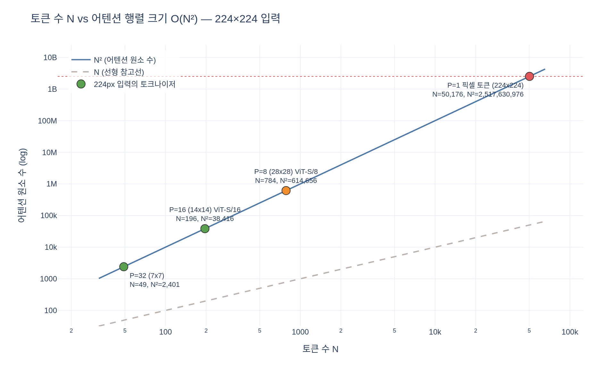

# ViT에서 픽셀 하나를 토큰으로 쓰면 왜 안 되는가?

## 한 줄 답

셀프 어텐션은 **모든 토큰 쌍**을 보므로 비용이 $O(N^2)$ 인데, 픽셀을 토큰으로 쓰면
$224\times224 = 50176$ 개 토큰이 되어 어텐션 행렬이 $50176^2 \approx 2.5\times10^9$ 원소로 폭발한다.
그래서 ViT는 $P\times P$ 픽셀 블록을 토큰 하나로 묶어 $N = (H/P)(W/P)$ 로 줄인다.

---

## 1. 왜 하필 $N^2$ 인가

트랜스포머 블록에서 **토큰끼리 정보를 섞는 곳은 `Attention` 하나뿐**이다
(`PatchEmbed`, `Mlp`, `LayerNorm`은 전부 토큰별로 똑같이 적용되는 연산이다).
그 `Attention`이 하는 일은

$$
\mathrm{Attn}(Q,K,V) = \mathrm{softmax}\!\left(\frac{QK^\top}{\sqrt{d_h}}\right)V
$$

이고, 여기서 $QK^\top$ 는 $(N \times N)$ 행렬이다. 토큰 $i$ 가 토큰 $j$ 를 얼마나 볼지를
모든 $(i,j)$ 쌍에 대해 계산하니, 토큰 수가 2배면 비용은 4배가 된다.

DINO의 `vision_transformer.py`는 이 행렬을 **실제로 메모리에 만든다** (어텐션 맵을
반환해 시각화에 쓰기 때문):

```python
attn = (q @ k.transpose(-2, -1)) * self.scale   # (B, heads, N, N)  ← 여기가 O(N^2)
attn = attn.softmax(dim=-1)
x = (attn @ v).transpose(1, 2).reshape(B, N, C)
return x, attn                                   # attn 을 그대로 내보낸다
```

FlashAttention 류는 이 행렬을 만들지 않고 타일 단위로 처리해 **메모리**를 $O(N)$ 으로 줄이지만,
**연산량**은 여전히 $O(N^2)$ 다. 즉 픽셀 토큰은 어느 구현으로도 구제되지 않는다.

## 2. 숫자로 확인

224×224 RGB 입력, ViT-S (heads=6), 배치 1장 기준:

| 토크나이저 | 격자 | $N$ (+CLS) | 어텐션 원소 $\text{heads}\cdot N^2$ | fp32 메모리 |
|---|---|---|---|---|
| **픽셀 = 토큰** ($P=1$) | 224×224 | 50177 | 15,106,387,974 | **약 56 GB** |
| ViT-S/8 | 28×28 | 785 | 3,697,350 | 14.1 MB |
| ViT-S/16 | 14×14 | 197 | 232,854 | 0.89 MB |
| ViT-S/32 | 7×7 | 50 | 15,000 | 0.06 MB |

- 배치 1장, 헤드 6개, **블록 1개**의 어텐션 행렬만으로 56 GB다. 블록이 12개고 역전파를 위해
  중간값을 들고 있어야 하니 실제로는 그 수 배가 더 필요하다 — 어떤 GPU로도 안 된다.
- patch16 대비 픽셀 토큰은 어텐션이 약 **6.5만 배**($16^4 = 65536$). $P$ 는 토큰 수를 $P^2$ 배 줄이고,
  어텐션은 그 제곱이므로 이득이 $P^4$ 다.
- 반대 방향으로도 같은 논리다: patch16 → patch8 로만 바꿔도 토큰이 4배($196\to784$),
  어텐션 행렬이 **16배**가 된다. DINO에서 `--patch_size 8` 이 OOM의 주범인 이유가 이것이다.

## 3. ViT의 해법: `PatchEmbed`

ViT 논문의 토큰화는 "패치를 flatten 해서 선형 투영"이다.

$$
z_p = W_e\,\mathrm{vec}(x_p) + b_e,\qquad
x_p \in \mathbb{R}^{P\times P\times C},\quad W_e \in \mathbb{R}^{D\times P^2C}
$$

DINO 구현은 이것을 **`Conv2d` 한 줄**로 처리한다.

```python
self.proj = nn.Conv2d(in_chans, embed_dim, kernel_size=patch_size, stride=patch_size)

def forward(self, x):
    return self.proj(x).flatten(2).transpose(1, 2)
```

`kernel_size = stride = P` 이므로 커널이 패치 경계에서 겹치지 않고 딱 맞아떨어진다 →
각 출력 위치가 **겹치지 않는 패치 하나의 선형 변환**이 되어 위 수식과 정확히 같다
(`expy.py` §5에서 `F.unfold` + 행렬곱과 수치가 일치함을 확인한다).

shape 변화:

$$
(B, 3, 224, 224) \xrightarrow{\text{Conv}} (B, D, 14, 14)
\xrightarrow{\text{flatten(2)}} (B, D, 196) \xrightarrow{\text{transpose}} (B, 196, D)
$$

$$
N = \frac{H}{P}\cdot\frac{W}{P} = \frac{224}{16}\cdot\frac{224}{16} = 14 \cdot 14 = 196
$$

여기에 CLS 토큰 1개가 붙어 $197$ 개가 어텐션에 들어간다.

## 4. 비용 말고도 있는 이유들

$O(N^2)$ 이 결정적이지만, 픽셀 토큰이 나쁜 이유는 하나 더 있다.

1. **토큰 하나에 정보가 거의 없다.** 픽셀 토큰의 입력은 값 3개(RGB)뿐이다.
   이걸 $D=384$ 차원으로 올려도 정보량이 늘지 않는다. 반면 patch16 토큰은
   $16\times16\times3 = 768$ 개 값 — 국소 텍스처/에지 구조가 토큰 하나에 담긴다.
2. **위치 임베딩 표가 커진다.** `pos_embed` 는 $(1, N+1, D)$ 학습 파라미터다.
   patch16이면 $197 \times 384$ 인데, 픽셀 토큰은 $50177 \times 384 \approx 19\text{M}$ 로
   모델 파라미터(ViT-S 21.7M)에 맞먹는다.
3. **어텐션의 역할이 낭비된다.** 인접 픽셀은 거의 같은 값이다. 전역 어텐션의 가치는
   "멀리 있는 것끼리 연결"인데, 픽셀 단위에서는 대부분의 예산을 사실상 중복인
   이웃 픽셀 쌍에 쓴다. 국소 집약은 Conv(= 패치 임베딩)가 싸게 처리하고,
   전역 관계만 어텐션에 넘기는 분업이다.

## 5. 함께 기억할 것

- **$P$ 는 파라미터를 거의 안 늘리고 연산량만 바꾸는 손잡이다.**
  `PatchEmbed` 파라미터는 $D\cdot P^2C + D$ (ViT-S/16이면 $384\cdot3\cdot16^2+384 = 295{,}296$,
  전체 21.7M의 1.4%)이고,
  나머지 블록 파라미터는 $P$ 와 무관하다. `patch_size` 16→8 은 **파라미터를 그대로 두고
  연산량만 약 16배**로 올린다.
- 같은 이유로 해상도를 바꿔도 파라미터는 그대로다 (Conv 커널이 공유). 바뀌는 건 $N$ 뿐이며,
  이때 `pos_embed` 를 `interpolate_pos_encoding` 으로 bicubic 보간해 맞춘다.
- 트레이드오프: $P$ 가 작으면 공간 해상도(세밀한 어텐션 맵, 분할 성능)가 좋아지고 비용이 폭증한다.
  DINO의 `vit_small` patch8 어텐션 맵이 patch16보다 훨씬 선명한 대신 무거운 것이 그 예다.

---

## 시각화

`expy.py` 실행 결과. 로그-로그 축에서 $N^2$ 은 기울기 2의 직선이고, 224px 입력의 각
토크나이저가 그 직선 위 어디에 놓이는지 표시한다. 픽셀 토큰만 $2.5\times10^9$ 선에 닿는다.


