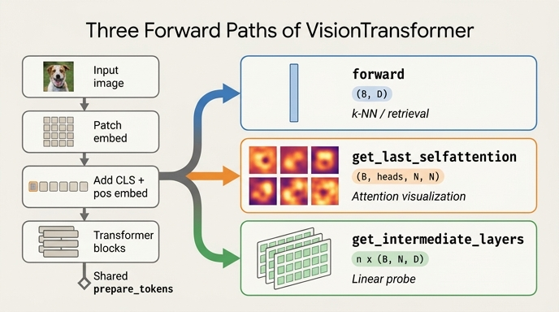

# `VisionTransformer`의 세 가지 forward 경로

DINO의 백본(`vision_transformer.py`)은 **하나의 가중치 세트**에서 서로 다른 세 가지 출력을 뽑을 수 있도록
공개 메서드를 세 개 노출한다. 어떤 것을 부르느냐에 따라 "무엇을 반환하는가"뿐 아니라
"어디까지 계산하는가"까지 달라진다.

| 메서드 | 출력 shape | 의미 | 주 소비자 |
|---|---|---|---|
| `forward(x)` | $(B, D)$ | 최종 CLS 임베딩 | `main_dino.py`(학습), `eval_knn.py`, `eval_image_retrieval.py` |
| `get_last_selfattention(x)` | $(B, h, N, N)$ | 마지막 블록의 어텐션 행렬 | `visualize_attention.py`, `video_generation.py` |
| `get_intermediate_layers(x, n)` | $n \times (B, N, D)$ | 마지막 $n$개 블록의 정규화된 토큰 | `eval_linear.py`, `eval_copy_detection.py`, `eval_video_segmentation.py` |

여기서 $B$=배치, $D$=`embed_dim`, $h$=`num_heads`, $N = 1 + HW/P^2$ (CLS 포함 토큰 수)다.

---

## 0. 공통 줄기: `prepare_tokens`

세 경로 모두 **첫 줄이 똑같다**. 토큰화 로직은 단 한 곳에만 존재한다.

```python
def prepare_tokens(self, x):
    B, nc, w, h = x.shape
    x = self.patch_embed(x)                       # (B, N-1, D)  patch linear embedding
    cls_tokens = self.cls_token.expand(B, -1, -1) # (B, 1, D)
    x = torch.cat((cls_tokens, x), dim=1)         # (B, N, D)
    x = x + self.interpolate_pos_encoding(x, w, h)
    return self.pos_drop(x)
```

$$
z_0 = \mathrm{Drop}\Big(\big[\,\mathrm{cls} \,\Vert\, \mathrm{Conv}_{P\times P}(x)\,\big] + E_{\text{pos}}\Big)
\in \mathbb{R}^{B\times N\times D}
$$

이 공유가 중요한 이유:

- **해상도 보간이 세 경로에 자동으로 따라온다.** `interpolate_pos_encoding`이 `prepare_tokens` 안에 있으므로,
  224가 아닌 입력(멀티크롭 96px, 비정방형 96×224, 고해상도 어텐션 시각화)도 세 경로 모두 동일하게 처리된다.
- **차이는 "블록 루프를 어떻게 도는가"에만 있다.** 세 메서드의 본체는 `prepare_tokens` 이후의
  for 루프 서너 줄이 전부다.

---

## 1. `forward` — CLS 벡터 $(B, D)$

```python
def forward(self, x):
    x = self.prepare_tokens(x)
    for blk in self.blocks:
        x = blk(x)
    x = self.norm(x)
    return x[:, 0]
```

$$
\mathrm{forward}(x) = \big[\mathrm{LN}(z_L)\big]_{:,0} \in \mathbb{R}^{B \times D}
$$

- 마지막에 `self.norm`을 한 번 더 적용하는 이유는 `Block`이 **pre-norm**이라서다
  ($x \leftarrow x + \mathrm{MHSA}(\mathrm{LN}(x))$). 마지막 블록 출력은 정규화되지 않은 상태로 나오므로
  백본 끝에서 `LayerNorm`을 한 번 걸어 준다.
- **패치 토큰 $N-1$개는 여기서 버려진다.** `x[:, 0]`만 남는다.
  패치 토큰이 필요하면 `get_intermediate_layers`를 써야 한다.
- `head`는 `num_classes=0`이면 `nn.Identity`이고, DINO 학습에서는 `MultiCropWrapper.__init__`이
  `backbone.fc, backbone.head = nn.Identity(), nn.Identity()`로 아예 죽인다
  (`utils.py`의 `MultiCropWrapper`). 즉 학습 시 백본 출력은 순수 CLS 벡터다.

### 소비자

- `main_dino.py` — `student(images)` / `teacher(images[:2])`가 `MultiCropWrapper`를 통해
  `backbone(...)` = `forward`를 부르고, $(B,D)$를 DINO head로 넘긴다.
- `eval_knn.py:105` — `feats = model(samples).clone()` → L2 정규화 후 k-NN 분류.
- `eval_image_retrieval.py` — `eval_knn.extract_features`를 그대로 재사용하므로 같은 경로다.

즉 "**하나의 이미지 = 하나의 벡터**"가 필요한 모든 작업(학습, k-NN, 검색)이 이 경로를 쓴다.

---

## 2. `get_last_selfattention` — 어텐션 맵 $(B, h, N, N)$

```python
def get_last_selfattention(self, x):
    x = self.prepare_tokens(x)
    for i, blk in enumerate(self.blocks):
        if i < len(self.blocks) - 1:
            x = blk(x)
        else:
            # return attention of the last block
            return blk(x, return_attention=True)
```

`Block`의 `return_attention` 분기가 이걸 가능하게 한다.

```python
def forward(self, x, return_attention=False):
    y, attn = self.attn(self.norm1(x))
    if return_attention:
        return attn          # <- 여기서 끝난다
    x = x + self.drop_path(y)
    x = x + self.drop_path(self.mlp(self.norm2(x)))
    return x
```

### 마지막 블록의 "출력"은 계산되지 않는다

$L-1$개 블록은 정상적으로 통과하지만, 마지막 블록은 `attn`만 뽑고 리턴한다.

$$
\mathrm{attn}^{(L)} = \mathrm{softmax}\!\left(\frac{QK^\top}{\sqrt{d_h}}\right),
\qquad Q,K = \mathrm{qkv}\big(\mathrm{LN}(z_{L-1})\big)
$$

- **residual 덧셈과 MLP가 실행되지 않는다** → $z_L$이 만들어지지 않는다.
- 따라서 **`self.norm`도 적용되지 않고**, CLS 임베딩도 나오지 않는다.
  이 경로에서는 `forward`의 결과를 얻을 수 없다(반대로 `forward`에서 어텐션도 얻을 수 없다).
- 엄밀히 말하면 `Attention.forward`는 항상 `(x, attn)` 튜플을 만들므로 `attn @ v`와 `proj`까지는
  계산된다. `Block`이 그 `y`를 버리는 것이고, **버려지는 것은 블록의 출력 토큰**이다.

### 소비자

`visualize_attention.py:179` 이하가 정확히 이 shape에 의존한다.

```python
attentions = model.get_last_selfattention(img.to(device))
nh = attentions.shape[1]                       # heads
attentions = attentions[0, :, 0, 1:].reshape(nh, -1)   # CLS -> patches
attentions = attentions.reshape(nh, w_featmap, h_featmap)
attentions = nn.functional.interpolate(attentions.unsqueeze(0),
                                       scale_factor=args.patch_size, mode="nearest")[0]
```

핵심 슬라이스는 `a[:, :, 0, 1:]` — **CLS 행에서 CLS 열을 제외한 부분**, 즉 $(B, h, N-1)$이다.
이걸 $\sqrt{N-1} \times \sqrt{N-1}$ 격자로 reshape하고 patch_size 배로 업샘플하면 헤드별 히트맵이 된다.
CLS→CLS 항을 뺐으므로 각 행의 합은 1보다 작다.

`video_generation.py:190`도 동일한 패턴(프레임마다 어텐션을 뽑아 영상으로 붙임)이다.

정량 지표로는 CLS 어텐션의 엔트로피

$$
H(a^{(h)}) = -\sum_{i=1}^{N-1} \hat{a}^{(h)}_i \log \hat{a}^{(h)}_i,
\qquad \hat{a}^{(h)} = \frac{a^{(h)}}{\sum_i a^{(h)}_i}
$$

를 쓴다. 랜덤 초기화는 모든 패치를 고르게 보므로 $H \approx \log(N-1)$이고,
DINO 사전학습 모델은 객체에 집중하므로 $H$가 뚜렷하게 낮다. 이것이 DINO 논문의 대표 그림이다.

---

## 3. `get_intermediate_layers` — 층별 토큰 $n \times (B, N, D)$

```python
def get_intermediate_layers(self, x, n=1):
    x = self.prepare_tokens(x)
    # we return the output tokens from the `n` last blocks
    output = []
    for i, blk in enumerate(self.blocks):
        x = blk(x)
        if len(self.blocks) - i <= n:
            output.append(self.norm(x))
    return output
```

$$
\mathrm{output} = \big[\,\mathrm{LN}(z_{L-n+1}),\ \ldots,\ \mathrm{LN}(z_L)\,\big],
\qquad \mathrm{LN}(z_l) \in \mathbb{R}^{B\times N\times D}
$$

### 두 가지 포인트

1. **각 중간 출력에 `self.norm`이 적용된다.** 같은 `LayerNorm` 모듈(마지막 정규화)을
   서로 다른 깊이의 출력에 재사용한다. 파라미터를 공유하는 것이라 층별 통계에 맞춰진 정규화는 아니지만,
   덕분에 여러 층 출력의 스케일이 맞춰져 concat해서 쓸 수 있다.
2. **CLS와 패치 토큰이 전부 살아 있다.** `forward`가 버리는 $N-1$개 패치 토큰을 여기서 얻는다
   (`eval_video_segmentation.py`는 `out[:, 1:, :]`로 CLS를 버리고 패치만 쓴다).

### `inter[-1][:, 0] == forward(x)`

마지막 원소는 `forward`와 정확히 같은 지점이다. 둘 다 $z_L$에 `self.norm`을 적용한 결과이므로:

$$
\big[\mathrm{output}[-1]\big]_{:,0} = \big[\mathrm{LN}(z_L)\big]_{:,0} = \mathrm{forward}(x)
$$

```python
f = m(xx)
inter = m.get_intermediate_layers(xx, n=4)
assert torch.allclose(inter[-1][:, 0], f, atol=1e-5)   # 최대 오차 ~1e-7
```

즉 `get_intermediate_layers`는 `forward`의 **상위집합**이다
(`forward`가 버리는 패치 토큰 + 이전 $n-1$개 층까지 추가로 준다).
반면 `get_last_selfattention`은 `forward`와 **분기**하는 경로다 — 겹치는 출력이 없다.

### 소비자: `eval_linear.py`

```python
intermediate_output = model.get_intermediate_layers(inp, n)
output = torch.cat([x[:, 0] for x in intermediate_output], dim=-1)
if avgpool:
    output = torch.cat((output.unsqueeze(-1),
                        torch.mean(intermediate_output[-1][:, 1:], dim=1).unsqueeze(-1)), dim=-1)
    output = output.reshape(output.shape[0], -1)
```

각 층의 CLS를 꺼내 concat해서 linear probe 입력으로 쓴다.

$$
\text{feature} = \big[\,\mathrm{CLS}^{(L-n+1)} \Vert \cdots \Vert \mathrm{CLS}^{(L)}\,\big]
\in \mathbb{R}^{D\cdot n}
$$

- 기본값 `--n_last_blocks 4` → ViT-S($D=384$)에서 $384 \times 4 = 1536$차원.
- `--avgpool_patchtokens`를 켜면 마지막 층 패치 토큰의 평균을 하나 더 붙여 $D\cdot n + D$차원이 된다.
- `eval_linear.py:41`의 `embed_dim = model.embed_dim * (args.n_last_blocks + int(args.avgpool_patchtokens))`가
  이 차원 계산을 그대로 반영한다.

왜 여러 층을 쓰나: 마지막 층만 쓰면 사전학습 목적(DINO loss)에 과하게 특화된 표현일 수 있다.
직전 몇 층을 함께 넣으면 linear probe 정확도가 올라간다 — 백본을 얼린 채로 표현력을 더 끌어내는 트릭이다.

`n=1`로 부르는 사용처도 있다.

- `eval_copy_detection.py:166` — `model.get_intermediate_layers(samples, n=1)[0]`
- `eval_video_segmentation.py:155` — `...n=1)[0]`, 이후 `out[:, 1:, :]`로 패치 토큰만 사용

이 경우는 CLS만 필요한 게 아니라 **패치 토큰이 필요**해서 `forward` 대신 이 경로를 쓴 것이다.

---

## 4. 정리 — 하나의 줄기, 세 개의 가지

```
image (B,3,H,W)
   │
   ▼
prepare_tokens  ──  patch_embed → [CLS ‖ patches] → + pos_embed(보간) → dropout
   │  z0 : (B, N, D)
   ▼
blocks[0 .. L-2]        (공통 구간)
   │
   ├─────────────────────────────────┬──────────────────────────────┐
   │ blocks[L-1] 전체 통과            │ blocks[L-1] attn 까지만       │ blocks[L-1] 통과
   ▼                                 ▼                              ▼
self.norm → x[:, 0]              return attn                  self.norm 을 최근 n개에 각각
   │                                 │                              │
   ▼                                 ▼                              ▼
(B, D)                          (B, h, N, N)                   n × (B, N, D)
학습 / k-NN / 검색                어텐션 시각화                    linear probe / 패치 특징
```

| | `forward` | `get_last_selfattention` | `get_intermediate_layers` |
|---|---|---|---|
| `prepare_tokens` 공유 | ✔ | ✔ | ✔ |
| 마지막 블록 출력 계산 | ✔ | **✘** | ✔ |
| `self.norm` 적용 | 1회 (끝) | **✘** | $n$회 (각 중간 출력) |
| 패치 토큰 반환 | ✘ (버림) | (어텐션 축으로 존재) | ✔ |
| CLS 반환 | ✔ | ✘ | ✔ (`[:, 0]`) |
| 백본 gradient | 학습 시 흐름 | `no_grad` 시각화용 | `no_grad` (백본 동결) |

암기 포인트 세 개:

1. 세 경로 모두 `prepare_tokens`로 시작한다 → 해상도 보간·CLS·pos_embed 로직은 한 곳에만 있다.
2. `get_last_selfattention`은 마지막 블록의 **출력을 만들지 않는다** (`return_attention=True`가
   residual/MLP 앞에서 리턴). 그래서 `self.norm`도 안 걸린다.
3. `get_intermediate_layers`는 각 중간 출력에 `self.norm`을 적용하며,
   그래서 `inter[-1][:, 0]`이 `forward(x)`와 정확히 일치한다.

## 인포그래픽


